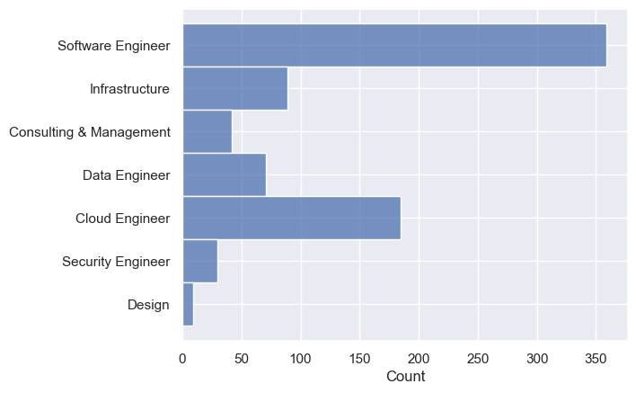
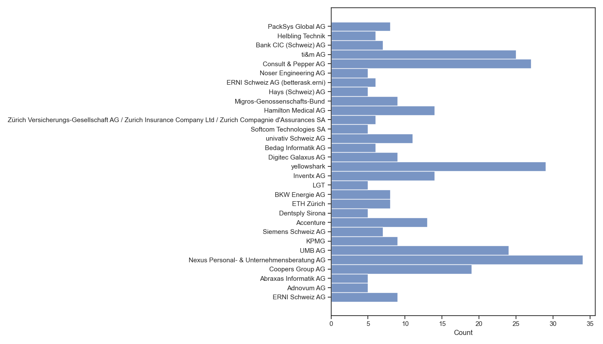
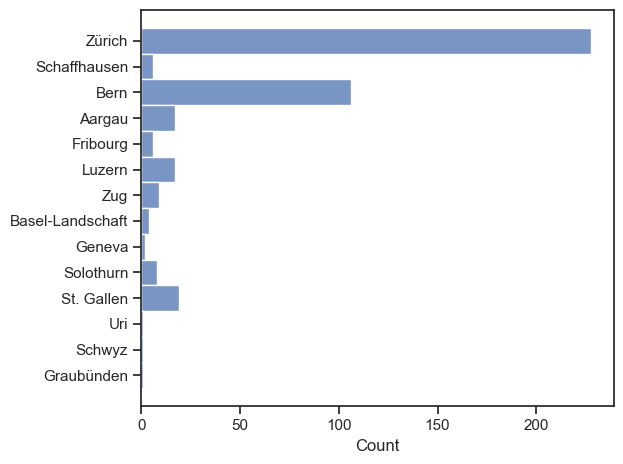
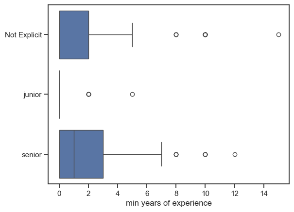
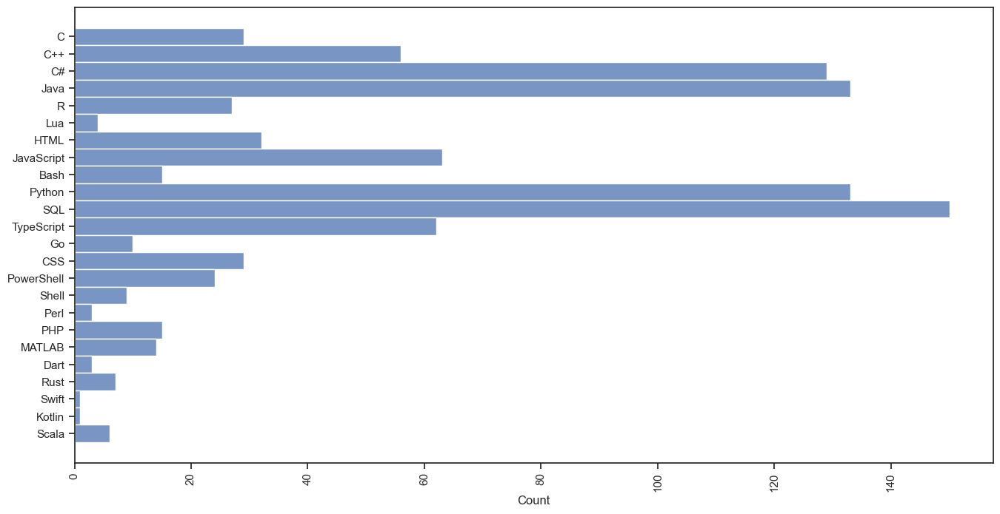
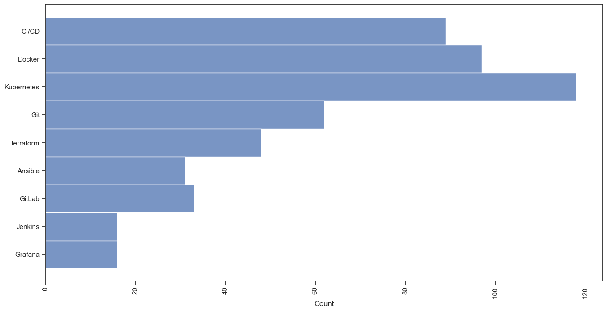
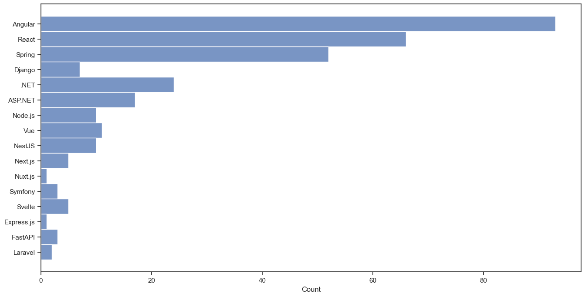

# Job Market Insights
This is a script that scrapes [jobs.ch](https://www.jobs.ch/en/) and [itjobs.ch](https://www.itjobs.ch/jobs/) to summarize, visualize, and filter interesting jobs.

**Last Data Downloaded:** 10 February, 2025

## **Setup Instructions**
### 1. Create and Activate the Conda Environment
Create a Conda environment called `itjobs` from the `environment.yml` file and install the required dependencies.

```bash
conda env create -f environment.yml
conda activate itjobs
```
### 2. Run the Scraper
If you want to download the latest data from jobs.ch and/or itjobs.ch run the scraper in `src/scraper.py`.
Alternatively, you can skip this step and use the already downloaded data in `data/jobs.json`
```bash
python src/scraper.py
```
### 3. Proprocess the Data
To clean and extract important information from the raw file jobs.json, run the `src/preprocessing.py` script, which will create the `jobs_processed.json` file in the data folder.
```bash
python src/preprocessing.py
```

## Publication Date

* A line plot showing the daily count of publications since 1.1.2025.

## Job Categories

* The job categories, based on titles and own classification, based on keywords.
## Top 30 Companies

* The top 30 companies offering the most IT-related job opportunities.

## Job Locations

* Distribution of job locations in Switzerland.

## Seniority of the Jobs

* Job seniority levels in the description/title and required years of experience from the description.

## Required Programming Languages

* Most commonly required programming languages in job postings.

## Required Tools

* Tools listed in job descriptions.

## Required Frameworks

* Frameworks listed in job descriptions.
