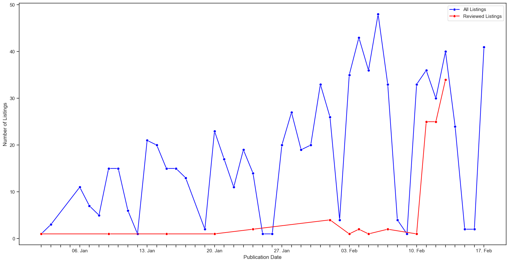

# Job Market Insights
This is a script that scrapes [jobs.ch](https://www.jobs.ch/en/) and [itjobs.ch](https://www.itjobs.ch/jobs/) to summarize, visualize, and filter interesting jobs.

**Last Data Downloaded:** 13 February, 2025


## Data Summary
Visualizations of published IT related jobs from jobs.ch and itjobs.ch 
### Publication Date

* A line plot showing the daily count of publications since 1.1.2025.

For more analysis, see `src/analysis.ipynb`

## **Setup Instructions**
### 1. Create and Activate the Conda Environment
Create a Conda environment called `itjobs` from the `environment.yml` file and install the required dependencies.

```bash
conda env create -f environment.yml
conda activate itjobs
```
### 2. Run the Scraper
If you want to download the latest data from jobs.ch and/or itjobs.ch run the scraper in `src/scraper.py`.

Alternatively, you can skip this step and use the already downloaded data in `data/jobs.json`
```bash
python src/scraper.py
```
### 3. Review jobs
You can review the downloaded jobs by running `src/review.py`. This each downloaded job (that is not rated so far) and the user can rate the job from 0-9.
```bash
python src/review.py
```
### 4. Preprocess the Data
To clean and extract important information from the raw file jobs.json, run the `src/preprocessing.py` script, which will create the `jobs_processed.json` file in the data folder.

Alternatively, you can skip this step and use the already preprocessed data in `data/jobs_preprocessed.json`
```bash
python src/preprocessing.py
```


