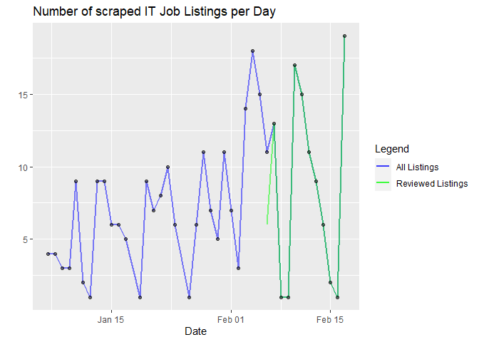
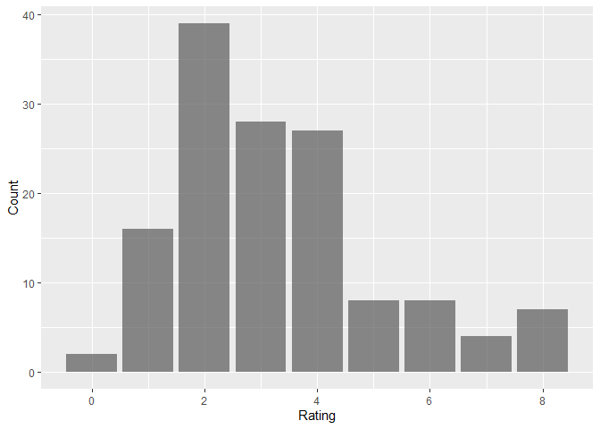
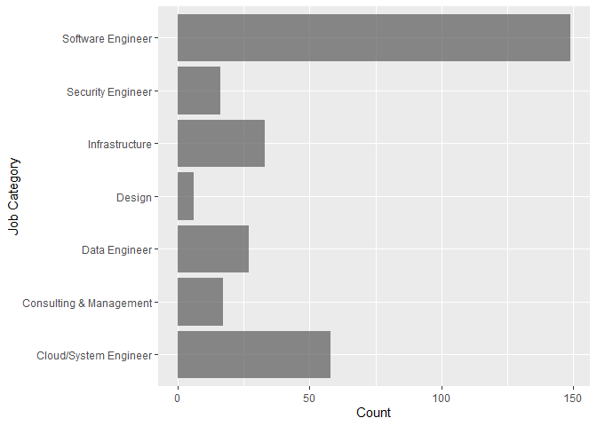
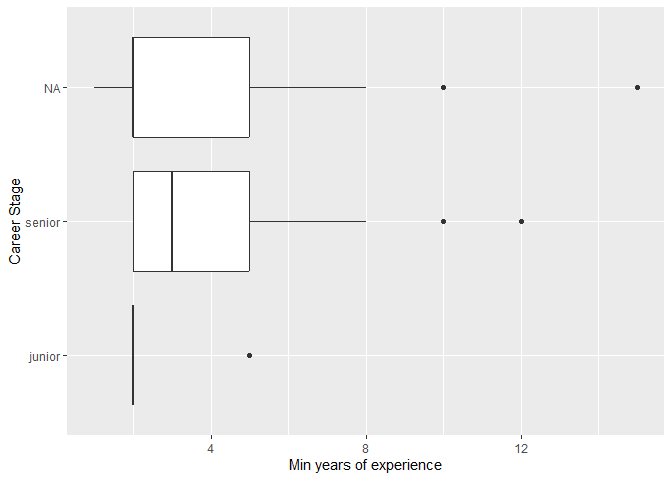
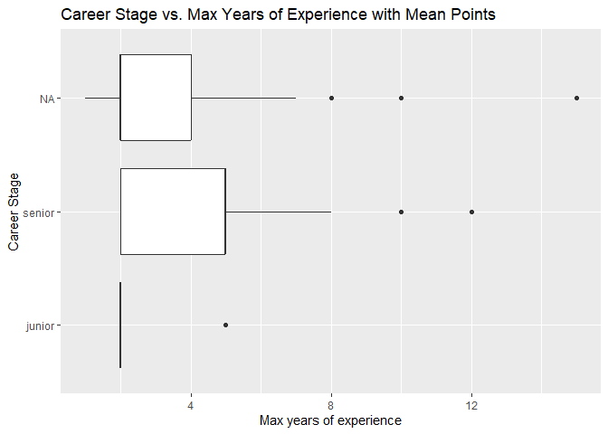
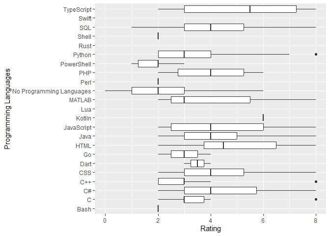
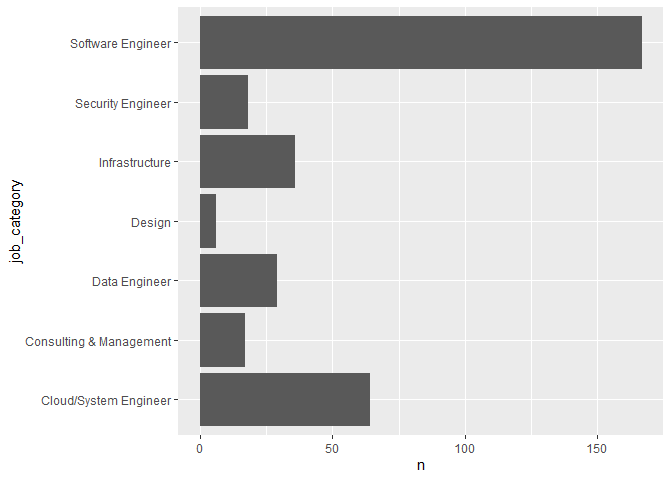
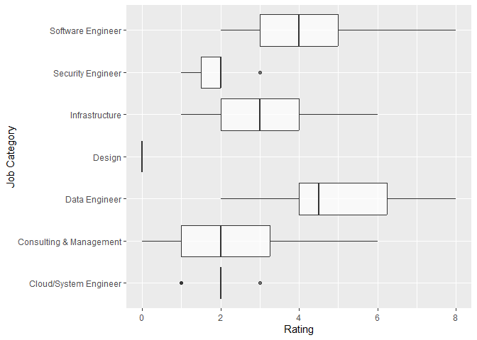
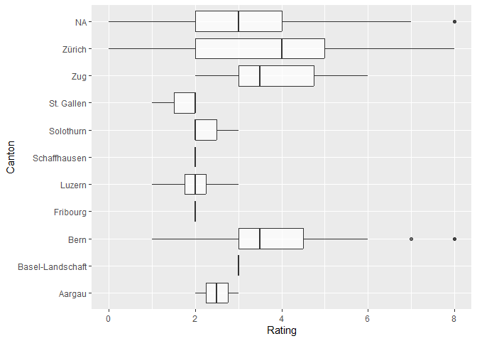
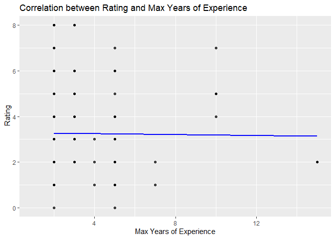

Data Analysis of IT jobs
================

Data Visualiization and Analysis from the data collected in the previous
steps from jobs.ch and itjobs.ch. Some of the job listings are rated
from a scale from 0,9 according to my interests and qualifications.

## Import Data

``` r
library(tidyverse)
library(jsonlite)
library(lubridate)
```

``` r
raw_df <- fromJSON("../data/jobs_processed.json")
raw_df <- bind_rows(raw_df)
glimpse(raw_df)
```

    ## Rows: 3,936
    ## Columns: 25
    ## $ company               <chr> NA, "BBT Software AG", "VAT Vakuumventile AG", "~
    ## $ contract_type         <chr> NA, NA, NA, "Unlimited employment", NA, NA, NA, ~
    ## $ descriptions          <list> [<data.frame[0 x 0]>], [<data.frame[1 x 1]>], [~
    ## $ downloaded            <lgl> TRUE, TRUE, TRUE, TRUE, TRUE, TRUE, TRUE, TRUE, ~
    ## $ job_title             <chr> "Bauingenieur*in (60-100%) Bereich Konstruktiver~
    ## $ language              <chr> NA, NA, NA, NA, NA, NA, NA, NA, "German (Interme~
    ## $ place_of_work         <chr> NA, "Root D4", NA, "Ringstrasse 39, 4106 Therwil~
    ## $ publication_date      <chr> NA, "06 February 2025", NA, "07 February 2025", ~
    ## $ rating                <dbl> NA, 2, NA, 6, NA, NA, NA, NA, NA, NA, NA, 4, NA,~
    ## $ reviewed              <dbl> NA, 1, NA, 1, NA, NA, NA, NA, NA, NA, NA, 1, NA,~
    ## $ salary                <chr> NA, NA, NA, NA, NA, NA, NA, NA, NA, NA, NA, NA, ~
    ## $ search_query          <chr> "data engineer", "all jobs", "software engineer"~
    ## $ url                   <chr> "https://www.jobs.ch/en/vacancies/detail/221d09c~
    ## $ website               <chr> NA, "ITJobs", "Jobs", NA, NA, NA, NA, NA, NA, "I~
    ## $ workload              <chr> NA, NA, NA, "100%", NA, NA, NA, NA, "80 – 100%",~
    ## $ career_stage_cleaned  <chr> NA, NA, NA, NA, NA, NA, NA, "senior", NA, NA, NA~
    ## $ canton                <chr> NA, NA, NA, NA, NA, NA, NA, NA, "Zürich", "Schwy~
    ## $ programming_languages <list> <>, <>, <>, <"MATLAB", "Python">, <>, <>, <>, <~
    ## $ frameworks            <list> <>, <>, <>, <>, <>, <>, <>, <>, <"Angular", "Sp~
    ## $ tools                 <list> <>, <>, <>, <>, <>, <>, <>, <>, <"Git", "Jenkin~
    ## $ operating_systems     <list> <>, <>, <>, <>, <>, <>, <>, <>, <>, <>, <>, <>,~
    ## $ years                 <list> <>, <>, <>, <>, <>, <>, <>, <>, 5, <>, <>, <>, ~
    ## $ education             <list> <>, <>, <>, "PhD", <>, <>, <>, <>, "Vocational"~
    ## $ job_title_cleaned     <chr> NA, "System Engineer", NA, "Research Engineer", ~
    ## $ job_category          <chr> NA, "Cloud/System Engineer", NA, "Software Engin~

## Clean Data

``` r
# convert datatypes
clean_df <- raw_df %>%
    mutate(publication_date = dmy(publication_date), 
        job_title_cleaned = factor(job_title_cleaned),
        career_stage_cleaned = factor(career_stage_cleaned),
        canton = factor(canton),
        programming_languages = lapply(programming_languages, factor),
        frameworks = lapply(frameworks, factor),
        tools = lapply(tools, factor),
        operating_systems = lapply(operating_systems, factor),
        max_years = sapply(years, function(x) if (length(x) == 0) NA else max(as.numeric(x), na.rm = TRUE)), # get min number of years, and replace nan with 0
        programming_languages = ifelse(lengths(programming_languages) == 0, "No Programming Languages", programming_languages),
        frameworks = ifelse(lengths(frameworks) == 0, "No Frameworks", frameworks),
        tools = ifelse(lengths(tools) == 0, "No Tools", tools))
colSums(is.na(clean_df))
```

    ##               company         contract_type          descriptions 
    ##                   923                  2669                     0 
    ##            downloaded             job_title              language 
    ##                     0                     0                  2913 
    ##         place_of_work      publication_date                rating 
    ##                  2077                  2084                  3463 
    ##              reviewed                salary          search_query 
    ##                  3463                  3815                     0 
    ##                   url               website              workload 
    ##                     0                  2525                  2642 
    ##  career_stage_cleaned                canton programming_languages 
    ##                  3266                  3131                     0 
    ##            frameworks                 tools     operating_systems 
    ##                     0                     0                     0 
    ##                 years             education     job_title_cleaned 
    ##                     0                     0                  2331 
    ##          job_category             max_years 
    ##                  2331                  3294

Check if some IT key words in listing title were missed during
preprocessing, and therefore have a NaN value in the `job_title_cleaned`
attribute.

``` r
clean_df %>%
  filter(is.na(job_title_cleaned)) %>%
  slice_head(n = 20) %>%
  pull(job_title) 
```

    ##  [1] "Bauingenieur*in (60-100%) Bereich Konstruktiver Wasserbau"                                  
    ##  [2] "Development Engineer Motion"                                                                
    ##  [3] "Responsable agence FS Vétroz"                                                               
    ##  [4] "2 PhD student positions in environmental soil chemistry (m/f/d)"                            
    ##  [5] "Wirtschaftsinformatikerin / Wirtschaftsinformatiker"                                        
    ##  [6] "Managing Director ETH Zurich | Space"                                                       
    ##  [7] "IT Operations Manager (w/m/d)"                                                              
    ##  [8] "Jurist:in Baurecht / Mandatsleitung 60-100%"                                                
    ##  [9] "Solution Architect:in 80–100 %"                                                             
    ## [10] "Quality Engineer"                                                                           
    ## [11] "217 .NET C# E ntwickler"                                                                    
    ## [12] "Data-Engineer/Data-Architect, 80–100 % (w/m/d)"                                             
    ## [13] "ProjektleiterIn in Schaffhausen"                                                            
    ## [14] "2 PhD Positions in Spine Biomechanics"                                                      
    ## [15] "Responsable du Service Bâtiments et Infrastructures"                                        
    ## [16] "Netzelektriker, Montage-Elektriker, Automatiker oder Polymechaniker (m/w/d) in Niedergösgen"
    ## [17] "Business Architekt/-in 80 - 100%"                                                           
    ## [18] "Responsable Qualité & Développement produits (h/f)"                                         
    ## [19] "IT Security Spezialist/-in 100%"                                                            
    ## [20] "Customer Support Engineer - Mexico, Brazil"

``` r
# drop NaN rows
df <- clean_df %>%
    filter(!is.na(job_title_cleaned) & !is.na(publication_date))%>%# drop rows with no cleaned job title, since they are probably no IT related jobs 
    filter(publication_date > as.Date("2025-01-01"))%>%
    filter(max_years <= 20) # outliers

    
glimpse(df)
```

    ## Rows: 306
    ## Columns: 26
    ## $ company               <chr> "ITech Consult AG", "Hug Engineering AG", "Persi~
    ## $ contract_type         <chr> "Freelance", "Unlimited employment", "Unlimited ~
    ## $ descriptions          <list> [<data.frame[3 x 3]>], [<data.frame[3 x 3]>], [~
    ## $ downloaded            <lgl> TRUE, TRUE, TRUE, TRUE, TRUE, TRUE, TRUE, TRUE, ~
    ## $ job_title             <chr> "Fullstack Applikationsentwickler(in) (Java, Ang~
    ## $ language              <chr> "German (Intermediate), English (Basic knowledge~
    ## $ place_of_work         <chr> "Zürich", "Im Geren 14, 8352 Elsau", "Sursee", "~
    ## $ publication_date      <date> 2025-02-05, 2025-01-08, 2025-02-03, 2025-01-16,~
    ## $ rating                <dbl> NA, NA, NA, NA, 7, NA, 2, NA, NA, NA, 4, NA, NA,~
    ## $ reviewed              <dbl> NA, NA, NA, NA, 1, NA, 1, NA, NA, NA, 1, NA, NA,~
    ## $ salary                <chr> NA, NA, NA, NA, NA, NA, NA, NA, NA, NA, NA, NA, ~
    ## $ search_query          <chr> "software engineer", "software engineer", "data ~
    ## $ url                   <chr> "https://www.jobs.ch/en/vacancies/detail/23d53c6~
    ## $ website               <chr> NA, NA, NA, NA, NA, NA, "Jobs", NA, NA, NA, "Job~
    ## $ workload              <chr> "80 – 100%", "100%", "100%", "80 – 100%", "80 – ~
    ## $ career_stage_cleaned  <fct> NA, NA, NA, NA, NA, NA, senior, NA, NA, NA, NA, ~
    ## $ canton                <fct> Zürich, NA, NA, NA, NA, NA, NA, NA, Schaffhausen~
    ## $ programming_languages <list> <Java, SQL>, <C, C++>, "No Programming Language~
    ## $ frameworks            <list> <Angular, Spring>, "No Frameworks", "No Framewo~
    ## $ tools                 <list> <Git, Jenkins>, "No Tools", "No Tools", <CI/CD,~
    ## $ operating_systems     <list> <>, <>, <>, <>, <>, <>, <>, <>, <>, <>, <>, <>,~
    ## $ years                 <list> 5, 2, 4, 3, 5, 3, <3, 5>, 2, 3, 2, <3, 5>, 5, 3~
    ## $ education             <list> "Vocational", <>, "Vocational", <>, <>, "PhD", ~
    ## $ job_title_cleaned     <fct> Applikationsentwickler, Automation Engineer, Sys~
    ## $ job_category          <chr> "Software Engineer", "Software Engineer", "Cloud~
    ## $ max_years             <dbl> 5, 2, 4, 3, 5, 3, 5, 2, 3, 2, 5, 5, 3, 5, 3, 2, ~

## Visualize

``` r
df %>%
    count(publication_date) %>%
    ggplot(aes(publication_date, n)) +
    geom_line(aes(color = "All Listings"), linewidth = 1, alpha=0.5) +  # Line for all listings
    geom_line(data = df %>% filter(reviewed == TRUE) %>% count(publication_date), 
            aes(publication_date, n, color = "Reviewed Listings"), linewidth = 1, alpha=0.5) +  # Line for reviewed listings
    geom_point(aes(publication_date, n), alpha=0.5)+
    labs(title = "Number of scraped IT Job Listings per Day",
        x = "Date",
        y = "") +
    scale_color_manual(name = "Legend", values = c("All Listings" = "blue", "Reviewed Listings" = "green"))
```

<!-- -->

``` r
df %>%
  ggplot() +
  geom_bar(mapping=aes(x=rating), alpha = 0.7)+
  labs(x = "Rating",
       y = "Count") 
```

    ## Warning: Removed 205 rows containing non-finite values (`stat_count()`).

<!-- -->

``` r
df %>%
  ggplot() +
  geom_bar(mapping=aes(y=job_category), alpha = 0.7)+
  labs(y = "Job Category",
       x = "Count") 
```

<!-- -->

``` r
p <- ggplot(df, aes(max_years, career_stage_cleaned))  +
    geom_boxplot() +
    labs(y = "Career Stage",
        x = "Min years of experience") 
print(p)
```

<!-- -->

``` r
df %>%
    unnest(programming_languages) %>%         # Unnest the list column
    count(programming_languages) %>%           # Count occurrences of each language
    ggplot(aes(x = n, y = programming_languages)) +  
    geom_bar(stat = "identity", alpha = 0.7) +
    labs(x = "Count", y = "Programming Language")
```

<!-- -->

``` r
df %>%
    unnest(programming_languages) %>% 
    ggplot(aes(x = rating , y = programming_languages)) +
    geom_boxplot() +
    labs(x = "Rating", y = "Programming Languages")
```

    ## Warning: Removed 353 rows containing non-finite values (`stat_boxplot()`).

<!-- -->

``` r
df %>%
    count(search_query) 
```

    ##        search_query   n
    ## 1          all jobs  38
    ## 2     data engineer  82
    ## 3    data scientist   9
    ## 4 software engineer 177

``` r
df %>%
    count(job_title_cleaned) %>%
    arrange(desc(n))
```

    ##            job_title_cleaned  n
    ## 1          Software Engineer 62
    ## 2            System Engineer 46
    ## 3         Software Developer 14
    ## 4              Data Engineer 10
    ## 5            DevOps Engineer 10
    ## 6        Automation Engineer  9
    ## 7          Security Engineer  9
    ## 8         Softwareentwickler  9
    ## 9              Entwickler:in  8
    ## 10          Systems Engineer  8
    ## 11      Application Engineer  7
    ## 12              Data Analyst  6
    ## 13          Network Engineer  6
    ## 14       Software Entwickler  6
    ## 15            Cloud Engineer  5
    ## 16           Design Engineer  5
    ## 17        Frontend Developer  5
    ## 18     Requirements Engineer  5
    ## 19         Platform Engineer  4
    ## 20        Software Architect  4
    ## 21         Solution Engineer  4
    ## 22             Test Engineer  4
    ## 23        Fullstack Engineer  3
    ## 24             ICT-Architekt  3
    ## 25             ICT Architekt  3
    ## 26          Projektleiter:in  3
    ## 27 Site Reliability Engineer  3
    ## 28               AI Engineer  2
    ## 29    Applikationsentwickler  2
    ## 30         Backend Developer  2
    ## 31            Data Scientist  2
    ## 32         Frontend Engineer  2
    ## 33      Full Stack Developer  2
    ## 34      Fullstack Entwickler  2
    ## 35                       R&D  2
    ## 36          Senior Developer  2
    ## 37          Softwareengineer  2
    ## 38           Systemingenieur  2
    ## 39         Angular Developer  1
    ## 40          Backend Engineer  1
    ## 41           Cloud-Architekt  1
    ## 42           Cloud Architect  1
    ## 43           Computer Vision  1
    ## 44    Cybersecurity Engineer  1
    ## 45                 Data & AI  1
    ## 46            Data Architect  1
    ## 47         Database Engineer  1
    ## 48       Fullstack Developer  1
    ## 49       IT-Security Manager  1
    ## 50             IT Management  1
    ## 51            Java Developer  1
    ## 52       Middleware Engineer  1
    ## 53         Research Engineer  1
    ## 54       Salesforce Engineer  1
    ## 55       Software-Entwickler  1
    ## 56         Softwarearchitekt  1
    ## 57          Storage Engineer  1
    ## 58             Teamlead Data  1
    ## 59            Technical Lead  1
    ## 60               UX Designer  1
    ## 61             Web Developer  1

``` r
df %>%
    count(job_category) %>%
    ggplot(aes(x = n, y = job_category)) +
    geom_bar(stat = "identity")
```

<!-- -->

``` r
df %>%
    ggplot(aes(x = rating , y = job_category)) +
    geom_boxplot(alpha = 0.7) +
    labs(x = "Rating", y = "Job Category")
```

    ## Warning: Removed 205 rows containing non-finite values (`stat_boxplot()`).

<!-- -->

``` r
df %>%
    ggplot(aes(x = rating , y = canton)) +
    geom_boxplot(alpha = 0.7) +
    labs(x = "Rating", y = "Canton")
```

    ## Warning: Removed 205 rows containing non-finite values (`stat_boxplot()`).

<!-- -->

``` r
df %>%
    ggplot(aes(x = max_years, y = rating )) +
    geom_point(alpha = 0.7) +
    geom_smooth(method = "lm", se = FALSE, color = "blue") +
    labs(x = "Max Years of Experience", y = " Rating", title = "Correlation between Rating and Max Years of Experience")
```

    ## `geom_smooth()` using formula = 'y ~ x'

    ## Warning: Removed 205 rows containing non-finite values (`stat_smooth()`).

    ## Warning: Removed 205 rows containing missing values (`geom_point()`).

<!-- -->

## Fit Model

``` r
# Unnest the programming_languages, tools, and frameworks columns
df_unnested <- df %>%
    filter(!is.na(rating))%>%
    select(contract_type, job_title_cleaned, rating, max_years, career_stage_cleaned, workload, programming_languages, frameworks, tools, job_category) %>%
    unnest(programming_languages) %>%
    unnest(tools) 

# One-hot encode the programming_languages column
df_one_hot <- df_unnested %>%
    mutate(value = 1) %>%
    pivot_wider(names_from = programming_languages, values_from = value, values_fill = list(value = 0))
```

    ## Error in `pivot_wider()`:
    ## ! Can't convert `fill` <double> to <list>.

``` r
# One-hot encode the tools column
df_one_hot <- df_one_hot %>%
    mutate(value = 1) %>%
    pivot_wider(names_from = tools, values_from = value, values_fill = list(value = 0))
```

    ## Error in mutate(., value = 1): object 'df_one_hot' not found

``` r
# One-hot encode the frameworks column
df_one_hot <- df_one_hot %>%
    mutate(value = 1) %>%
    pivot_wider(names_from = frameworks, values_from = value, values_fill = list(value = 0))
```

    ## Error in mutate(., value = 1): object 'df_one_hot' not found

``` r
glimpse(df_one_hot)
```

    ## Error in glimpse(df_one_hot): object 'df_one_hot' not found

``` r
test
```

    ## Error in eval(expr, envir, enclos): object 'test' not found

``` r
set.seed(1)
sample <- sample(c(TRUE, FALSE), nrow(df_one_hot), replace=TRUE, prob=c(0.7,0.3))
```

    ## Error in nrow(df_one_hot): object 'df_one_hot' not found

``` r
train  <- df_one_hot[sample, ]
```

    ## Error in eval(expr, envir, enclos): object 'df_one_hot' not found

``` r
test   <- df_one_hot[!sample, ]
```

    ## Error in eval(expr, envir, enclos): object 'df_one_hot' not found

``` r
# Fit a linear regression model
model <- lm(rating ~ ., data = train)
```

    ## Error in is.data.frame(data): object 'train' not found

``` r
# Summarize the model
summary(model)
```

    ## Error in summary(model): object 'model' not found
