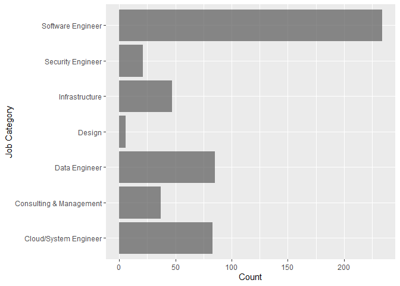

Data Analysis of IT jobs
================

Data Visualiization and Analysis from the data collected in the previous
steps from jobs.ch and itjobs.ch. Some of the job listings are rated
from a scale from 0,9 according to my interests and qualifications.

## Import Data

``` r
library(tidyverse)
library(jsonlite)
library(lubridate)
```

``` r
raw_df <- fromJSON("../data/jobs_processed.json")
raw_df <- bind_rows(raw_df)
raw_df <- tibble(raw_df)
glimpse(raw_df)
```

    ## Rows: 3,936
    ## Columns: 25
    ## $ company               <chr> NA, "BBT Software AG", "VAT Vakuumventile AG", "~
    ## $ contract_type         <chr> NA, NA, NA, "Unlimited employment", NA, NA, NA, ~
    ## $ descriptions          <list> [<data.frame[0 x 0]>], [<data.frame[1 x 1]>], [~
    ## $ downloaded            <lgl> TRUE, TRUE, TRUE, TRUE, TRUE, TRUE, TRUE, TRUE, ~
    ## $ job_title             <chr> "Bauingenieur*in (60-100%) Bereich Konstruktiver~
    ## $ language              <chr> NA, NA, NA, NA, NA, NA, NA, NA, "German (Interme~
    ## $ place_of_work         <chr> NA, "Root D4", NA, "Ringstrasse 39, 4106 Therwil~
    ## $ publication_date      <chr> NA, "06 February 2025", NA, "07 February 2025", ~
    ## $ rating                <dbl> NA, 2, NA, 6, NA, NA, NA, NA, NA, NA, NA, 4, NA,~
    ## $ reviewed              <dbl> NA, 1, NA, 1, NA, NA, NA, NA, NA, NA, NA, 1, NA,~
    ## $ salary                <chr> NA, NA, NA, NA, NA, NA, NA, NA, NA, NA, NA, NA, ~
    ## $ search_query          <chr> "data engineer", "all jobs", "software engineer"~
    ## $ url                   <chr> "https://www.jobs.ch/en/vacancies/detail/221d09c~
    ## $ website               <chr> NA, "ITJobs", "Jobs", NA, NA, NA, NA, NA, NA, "I~
    ## $ workload              <chr> NA, NA, NA, "100%", NA, NA, NA, NA, "80 – 100%",~
    ## $ career_stage_cleaned  <chr> NA, NA, NA, NA, NA, NA, NA, "senior", NA, NA, NA~
    ## $ canton                <chr> NA, NA, NA, NA, NA, NA, NA, NA, "Zürich", "Schwy~
    ## $ programming_languages <list> <>, <>, <>, <"MATLAB", "Python">, <>, <>, <>, <~
    ## $ frameworks            <list> <>, <>, <>, <>, <>, <>, <>, <>, <"Angular", "Sp~
    ## $ tools                 <list> <>, <>, <>, <>, <>, <>, <>, <>, <"Git", "Jenkin~
    ## $ operating_systems     <list> <>, <>, <>, <>, <>, <>, <>, <>, <>, <>, <>, <>,~
    ## $ years                 <list> <>, <>, <>, <>, <>, <>, <>, <>, 5, <>, <>, <>, ~
    ## $ education             <list> <>, <>, <>, "PhD", <>, <>, <>, <>, "Vocational"~
    ## $ job_title_cleaned     <chr> NA, "System Engineer", NA, "Research Engineer", ~
    ## $ job_category          <chr> NA, "Cloud/System Engineer", NA, "Software Engin~

## Clean Data

``` r
# convert datatypes
clean_df <- raw_df %>%
    mutate(publication_date = dmy(publication_date), 
        job_title_cleaned = factor(job_title_cleaned),
        career_stage_cleaned = factor(career_stage_cleaned),
        job_category = factor(job_category),
        canton = factor(canton),
        programming_languages = lapply(programming_languages, factor),
        frameworks = lapply(frameworks, factor),
        tools = lapply(tools, factor),
        operating_systems = lapply(operating_systems, factor),
        max_years = sapply(years, function(x) if (length(x) == 0) NA else max(as.numeric(x), na.rm = TRUE)), # get min number of years, and replace nan with 0
        programming_languages = ifelse(lengths(programming_languages) == 0, "No Programming Languages", programming_languages),
        frameworks = ifelse(lengths(frameworks) == 0, "No Frameworks", frameworks),
        tools = ifelse(lengths(tools) == 0, "No Tools", tools))
glimpse(clean_df)
```

    ## Rows: 3,936
    ## Columns: 26
    ## $ company               <chr> NA, "BBT Software AG", "VAT Vakuumventile AG", "~
    ## $ contract_type         <chr> NA, NA, NA, "Unlimited employment", NA, NA, NA, ~
    ## $ descriptions          <list> [<data.frame[0 x 0]>], [<data.frame[1 x 1]>], [~
    ## $ downloaded            <lgl> TRUE, TRUE, TRUE, TRUE, TRUE, TRUE, TRUE, TRUE, ~
    ## $ job_title             <chr> "Bauingenieur*in (60-100%) Bereich Konstruktiver~
    ## $ language              <chr> NA, NA, NA, NA, NA, NA, NA, NA, "German (Interme~
    ## $ place_of_work         <chr> NA, "Root D4", NA, "Ringstrasse 39, 4106 Therwil~
    ## $ publication_date      <date> NA, 2025-02-06, NA, 2025-02-07, NA, NA, NA, NA,~
    ## $ rating                <dbl> NA, 2, NA, 6, NA, NA, NA, NA, NA, NA, NA, 4, NA,~
    ## $ reviewed              <dbl> NA, 1, NA, 1, NA, NA, NA, NA, NA, NA, NA, 1, NA,~
    ## $ salary                <chr> NA, NA, NA, NA, NA, NA, NA, NA, NA, NA, NA, NA, ~
    ## $ search_query          <chr> "data engineer", "all jobs", "software engineer"~
    ## $ url                   <chr> "https://www.jobs.ch/en/vacancies/detail/221d09c~
    ## $ website               <chr> NA, "ITJobs", "Jobs", NA, NA, NA, NA, NA, NA, "I~
    ## $ workload              <chr> NA, NA, NA, "100%", NA, NA, NA, NA, "80 – 100%",~
    ## $ career_stage_cleaned  <fct> NA, NA, NA, NA, NA, NA, NA, senior, NA, NA, NA, ~
    ## $ canton                <fct> NA, NA, NA, NA, NA, NA, NA, NA, Zürich, Schwyz, ~
    ## $ programming_languages <list> "No Programming Languages", "No Programming Lan~
    ## $ frameworks            <list> "No Frameworks", "No Frameworks", "No Framework~
    ## $ tools                 <list> "No Tools", "No Tools", "No Tools", "No Tools",~
    ## $ operating_systems     <list> <>, <>, <>, <>, <>, <>, <>, <>, <>, <>, <>, <>,~
    ## $ years                 <list> <>, <>, <>, <>, <>, <>, <>, <>, 5, <>, <>, <>, ~
    ## $ education             <list> <>, <>, <>, "PhD", <>, <>, <>, <>, "Vocational"~
    ## $ job_title_cleaned     <fct> NA, System Engineer, NA, Research Engineer, NA, ~
    ## $ job_category          <fct> NA, Cloud/System Engineer, NA, Software Engineer~
    ## $ max_years             <dbl> NA, NA, NA, NA, NA, NA, NA, NA, 5, NA, NA, NA, N~

Check if some IT key words in listing title were missed during
preprocessing, and therefore have a NaN value in the `job_title_cleaned`
attribute.

``` r
clean_df %>%
  filter(is.na(job_title_cleaned)) %>%
  slice_head(n = 20) %>%
  pull(job_title) 
```

    ##  [1] "Bauingenieur*in (60-100%) Bereich Konstruktiver Wasserbau"                                  
    ##  [2] "Development Engineer Motion"                                                                
    ##  [3] "Responsable agence FS Vétroz"                                                               
    ##  [4] "2 PhD student positions in environmental soil chemistry (m/f/d)"                            
    ##  [5] "Wirtschaftsinformatikerin / Wirtschaftsinformatiker"                                        
    ##  [6] "Managing Director ETH Zurich | Space"                                                       
    ##  [7] "IT Operations Manager (w/m/d)"                                                              
    ##  [8] "Jurist:in Baurecht / Mandatsleitung 60-100%"                                                
    ##  [9] "Solution Architect:in 80–100 %"                                                             
    ## [10] "Quality Engineer"                                                                           
    ## [11] "217 .NET C# E ntwickler"                                                                    
    ## [12] "Data-Engineer/Data-Architect, 80–100 % (w/m/d)"                                             
    ## [13] "ProjektleiterIn in Schaffhausen"                                                            
    ## [14] "2 PhD Positions in Spine Biomechanics"                                                      
    ## [15] "Responsable du Service Bâtiments et Infrastructures"                                        
    ## [16] "Netzelektriker, Montage-Elektriker, Automatiker oder Polymechaniker (m/w/d) in Niedergösgen"
    ## [17] "Business Architekt/-in 80 - 100%"                                                           
    ## [18] "Responsable Qualité & Développement produits (h/f)"                                         
    ## [19] "IT Security Spezialist/-in 100%"                                                            
    ## [20] "Customer Support Engineer - Mexico, Brazil"

``` r
# drop NaN rows
df <- clean_df %>%
    filter(!is.na(job_title_cleaned) & !is.na(publication_date))%>%# drop rows with no cleaned job title, since they are probably no IT related jobs 
    filter(publication_date > as.Date("2025-01-01"))%>%
    filter(max_years <= 20) # outliers

    
glimpse(df)
```

    ## Rows: 306
    ## Columns: 26
    ## $ company               <chr> "ITech Consult AG", "Hug Engineering AG", "Persi~
    ## $ contract_type         <chr> "Freelance", "Unlimited employment", "Unlimited ~
    ## $ descriptions          <list> [<data.frame[3 x 3]>], [<data.frame[3 x 3]>], [~
    ## $ downloaded            <lgl> TRUE, TRUE, TRUE, TRUE, TRUE, TRUE, TRUE, TRUE, ~
    ## $ job_title             <chr> "Fullstack Applikationsentwickler(in) (Java, Ang~
    ## $ language              <chr> "German (Intermediate), English (Basic knowledge~
    ## $ place_of_work         <chr> "Zürich", "Im Geren 14, 8352 Elsau", "Sursee", "~
    ## $ publication_date      <date> 2025-02-05, 2025-01-08, 2025-02-03, 2025-01-16,~
    ## $ rating                <dbl> NA, NA, NA, NA, 7, NA, 2, NA, NA, NA, 4, NA, NA,~
    ## $ reviewed              <dbl> NA, NA, NA, NA, 1, NA, 1, NA, NA, NA, 1, NA, NA,~
    ## $ salary                <chr> NA, NA, NA, NA, NA, NA, NA, NA, NA, NA, NA, NA, ~
    ## $ search_query          <chr> "software engineer", "software engineer", "data ~
    ## $ url                   <chr> "https://www.jobs.ch/en/vacancies/detail/23d53c6~
    ## $ website               <chr> NA, NA, NA, NA, NA, NA, "Jobs", NA, NA, NA, "Job~
    ## $ workload              <chr> "80 – 100%", "100%", "100%", "80 – 100%", "80 – ~
    ## $ career_stage_cleaned  <fct> NA, NA, NA, NA, NA, NA, senior, NA, NA, NA, NA, ~
    ## $ canton                <fct> Zürich, NA, NA, NA, NA, NA, NA, NA, Schaffhausen~
    ## $ programming_languages <list> <Java, SQL>, <C, C++>, "No Programming Language~
    ## $ frameworks            <list> <Angular, Spring>, "No Frameworks", "No Framewo~
    ## $ tools                 <list> <Git, Jenkins>, "No Tools", "No Tools", <CI/CD,~
    ## $ operating_systems     <list> <>, <>, <>, <>, <>, <>, <>, <>, <>, <>, <>, <>,~
    ## $ years                 <list> 5, 2, 4, 3, 5, 3, <3, 5>, 2, 3, 2, <3, 5>, 5, 3~
    ## $ education             <list> "Vocational", <>, "Vocational", <>, <>, "PhD", ~
    ## $ job_title_cleaned     <fct> Applikationsentwickler, Automation Engineer, Sys~
    ## $ job_category          <fct> Software Engineer, Software Engineer, Cloud/Syst~
    ## $ max_years             <dbl> 5, 2, 4, 3, 5, 3, 5, 2, 3, 2, 5, 5, 3, 5, 3, 2, ~

## Visualize

``` r
df %>%
    count(publication_date) %>%
    ggplot(aes(publication_date, n)) +
    geom_line(aes(color = "All Listings"), linewidth = 1, alpha=0.5) +  # Line for all listings
    geom_line(data = df %>% filter(reviewed == TRUE) %>% count(publication_date), 
            aes(publication_date, n, color = "Reviewed Listings"), linewidth = 1, alpha=0.5) +  # Line for reviewed listings
    geom_point(aes(publication_date, n), alpha=0.5)+
    labs(title = "Number of scraped IT Job Listings per Day",
        x = "Date",
        y = "") +
    scale_color_manual(name = "Legend", values = c("All Listings" = "blue", "Reviewed Listings" = "green"))
```

<!-- -->

``` r
df %>%
  ggplot() +
  geom_bar(mapping=aes(x=rating), alpha = 0.7)+
  labs(x = "Rating",
       y = "Count") 
```

    ## Warning: Removed 205 rows containing non-finite values (`stat_count()`).

<!-- -->

``` r
df %>%
  ggplot() +
  geom_bar(mapping=aes(y=job_category), alpha = 0.7)+
  labs(y = "Job Category",
       x = "Count") 
```

<!-- -->

``` r
p <- ggplot(df, aes(max_years, career_stage_cleaned))  +
    geom_boxplot() +
    labs(y = "Career Stage",
        x = "Min years of experience") 
print(p)
```

<!-- -->

``` r
df %>%
    unnest(programming_languages) %>%         # Unnest the list column
    count(programming_languages) %>%           # Count occurrences of each language
    ggplot(aes(x = n, y = programming_languages)) +  
    geom_bar(stat = "identity", alpha = 0.7) +
    labs(x = "Count", y = "Programming Language")
```

<!-- -->

``` r
df %>%
    unnest(programming_languages) %>% 
    ggplot(aes(x = rating , y = programming_languages)) +
    geom_boxplot() +
    labs(x = "Rating", y = "Programming Languages")
```

    ## Warning: Removed 353 rows containing non-finite values (`stat_boxplot()`).

<!-- -->

``` r
df %>%
    count(search_query) 
```

    ## # A tibble: 4 x 2
    ##   search_query          n
    ##   <chr>             <int>
    ## 1 all jobs             38
    ## 2 data engineer        82
    ## 3 data scientist        9
    ## 4 software engineer   177

``` r
df %>%
    count(job_title_cleaned) %>%
    arrange(desc(n))
```

    ## # A tibble: 61 x 2
    ##    job_title_cleaned       n
    ##    <fct>               <int>
    ##  1 Software Engineer      62
    ##  2 System Engineer        46
    ##  3 Software Developer     14
    ##  4 Data Engineer          10
    ##  5 DevOps Engineer        10
    ##  6 Automation Engineer     9
    ##  7 Security Engineer       9
    ##  8 Softwareentwickler      9
    ##  9 Entwickler:in           8
    ## 10 Systems Engineer        8
    ## # i 51 more rows

``` r
df %>%
    count(job_category) %>%
    ggplot(aes(x = n, y = job_category)) +
    geom_bar(stat = "identity")
```

<!-- -->

``` r
df %>%
    ggplot(aes(x = rating , y = job_category)) +
    geom_boxplot(alpha = 0.7) +
    labs(x = "Rating", y = "Job Category")
```

    ## Warning: Removed 205 rows containing non-finite values (`stat_boxplot()`).

<!-- -->

``` r
df %>%
    ggplot(aes(x = rating , y = canton)) +
    geom_boxplot(alpha = 0.7) +
    labs(x = "Rating", y = "Canton")
```

    ## Warning: Removed 205 rows containing non-finite values (`stat_boxplot()`).

<!-- -->

``` r
df %>%
    ggplot(aes(x = max_years, y = rating )) +
    geom_point(alpha = 0.7) +
    geom_smooth(method = "lm", se = FALSE, color = "blue") +
    labs(x = "Max Years of Experience", y = " Rating", title = "Correlation between Rating and Max Years of Experience")
```

    ## `geom_smooth()` using formula = 'y ~ x'

    ## Warning: Removed 205 rows containing non-finite values (`stat_smooth()`).

    ## Warning: Removed 205 rows containing missing values (`geom_point()`).

<!-- -->

## Fit Model

``` r
df_one_hot <- df %>%
    select(url, job_category, career_stage_cleaned, programming_languages, frameworks, max_years, rating ) %>%
    mutate(programming_languages = lapply(programming_languages, factor)) %>%
    unnest(programming_languages) %>%
    distinct() %>%
    mutate(temp = 1) %>%
    pivot_wider(names_from = programming_languages, values_from = temp, values_fill = list(temp = 0))%>%
    unnest(frameworks) %>%
    distinct() %>%
    mutate(temp = 1) %>%
    pivot_wider(names_from = frameworks, values_from = temp, values_fill = list(temp = 0))

    

glimpse(df_one_hot)
```

    ## Rows: 306
    ## Columns: 43
    ## $ url                        <chr> "https://www.jobs.ch/en/vacancies/detail/23~
    ## $ job_category               <fct> Software Engineer, Software Engineer, Cloud~
    ## $ career_stage_cleaned       <fct> NA, NA, NA, NA, NA, NA, senior, NA, NA, NA,~
    ## $ max_years                  <dbl> 5, 2, 4, 3, 5, 3, 5, 2, 3, 2, 5, 5, 3, 5, 3~
    ## $ rating                     <dbl> NA, NA, NA, NA, 7, NA, 2, NA, NA, NA, 4, NA~
    ## $ Java                       <dbl> 1, 0, 0, 0, 0, 0, 0, 0, 0, 0, 0, 0, 0, 1, 1~
    ## $ SQL                        <dbl> 1, 0, 0, 0, 1, 0, 0, 1, 0, 0, 0, 1, 0, 1, 1~
    ## $ C                          <dbl> 0, 1, 0, 0, 0, 1, 0, 0, 0, 0, 0, 0, 0, 0, 0~
    ## $ `C++`                      <dbl> 0, 1, 0, 0, 0, 1, 0, 0, 1, 0, 0, 0, 0, 0, 0~
    ## $ `No Programming Languages` <dbl> 0, 0, 1, 0, 0, 0, 0, 0, 0, 1, 0, 0, 0, 0, 0~
    ## $ `C#`                       <dbl> 0, 0, 0, 1, 0, 0, 0, 0, 0, 0, 0, 0, 1, 0, 0~
    ## $ Python                     <dbl> 0, 0, 0, 1, 0, 0, 1, 0, 0, 0, 1, 1, 0, 0, 0~
    ## $ MATLAB                     <dbl> 0, 0, 0, 0, 0, 1, 0, 0, 0, 0, 0, 0, 0, 0, 0~
    ## $ Shell                      <dbl> 0, 0, 0, 0, 0, 0, 1, 0, 0, 0, 0, 0, 0, 0, 0~
    ## $ Lua                        <dbl> 0, 0, 0, 0, 0, 0, 0, 0, 1, 0, 0, 0, 0, 0, 0~
    ## $ CSS                        <dbl> 0, 0, 0, 0, 0, 0, 0, 0, 0, 0, 0, 0, 1, 0, 0~
    ## $ HTML                       <dbl> 0, 0, 0, 0, 0, 0, 0, 0, 0, 0, 0, 0, 1, 0, 1~
    ## $ TypeScript                 <dbl> 0, 0, 0, 0, 0, 0, 0, 0, 0, 0, 0, 0, 1, 0, 1~
    ## $ JavaScript                 <dbl> 0, 0, 0, 0, 0, 0, 0, 0, 0, 0, 0, 0, 0, 0, 1~
    ## $ Bash                       <dbl> 0, 0, 0, 0, 0, 0, 0, 0, 0, 0, 0, 0, 0, 0, 0~
    ## $ Go                         <dbl> 0, 0, 0, 0, 0, 0, 0, 0, 0, 0, 0, 0, 0, 0, 0~
    ## $ PowerShell                 <dbl> 0, 0, 0, 0, 0, 0, 0, 0, 0, 0, 0, 0, 0, 0, 0~
    ## $ Kotlin                     <dbl> 0, 0, 0, 0, 0, 0, 0, 0, 0, 0, 0, 0, 0, 0, 0~
    ## $ PHP                        <dbl> 0, 0, 0, 0, 0, 0, 0, 0, 0, 0, 0, 0, 0, 0, 0~
    ## $ Dart                       <dbl> 0, 0, 0, 0, 0, 0, 0, 0, 0, 0, 0, 0, 0, 0, 0~
    ## $ Perl                       <dbl> 0, 0, 0, 0, 0, 0, 0, 0, 0, 0, 0, 0, 0, 0, 0~
    ## $ Rust                       <dbl> 0, 0, 0, 0, 0, 0, 0, 0, 0, 0, 0, 0, 0, 0, 0~
    ## $ Swift                      <dbl> 0, 0, 0, 0, 0, 0, 0, 0, 0, 0, 0, 0, 0, 0, 0~
    ## $ Angular                    <dbl> 1, 0, 0, 0, 0, 0, 0, 0, 0, 0, 0, 0, 0, 0, 1~
    ## $ Spring                     <dbl> 1, 0, 0, 0, 0, 0, 0, 0, 0, 0, 0, 0, 0, 1, 1~
    ## $ `No Frameworks`            <dbl> 0, 1, 1, 0, 1, 1, 1, 1, 1, 1, 1, 1, 0, 0, 0~
    ## $ React                      <dbl> 0, 0, 0, 1, 0, 0, 0, 0, 0, 0, 0, 0, 1, 0, 1~
    ## $ Next.js                    <dbl> 0, 0, 0, 0, 0, 0, 0, 0, 0, 0, 0, 0, 1, 0, 0~
    ## $ Vue                        <dbl> 0, 0, 0, 0, 0, 0, 0, 0, 0, 0, 0, 0, 0, 0, 1~
    ## $ .NET                       <dbl> 0, 0, 0, 0, 0, 0, 0, 0, 0, 0, 0, 0, 0, 0, 0~
    ## $ ASP.NET                    <dbl> 0, 0, 0, 0, 0, 0, 0, 0, 0, 0, 0, 0, 0, 0, 0~
    ## $ Node.js                    <dbl> 0, 0, 0, 0, 0, 0, 0, 0, 0, 0, 0, 0, 0, 0, 0~
    ## $ NestJS                     <dbl> 0, 0, 0, 0, 0, 0, 0, 0, 0, 0, 0, 0, 0, 0, 0~
    ## $ Svelte                     <dbl> 0, 0, 0, 0, 0, 0, 0, 0, 0, 0, 0, 0, 0, 0, 0~
    ## $ Django                     <dbl> 0, 0, 0, 0, 0, 0, 0, 0, 0, 0, 0, 0, 0, 0, 0~
    ## $ FastAPI                    <dbl> 0, 0, 0, 0, 0, 0, 0, 0, 0, 0, 0, 0, 0, 0, 0~
    ## $ Symfony                    <dbl> 0, 0, 0, 0, 0, 0, 0, 0, 0, 0, 0, 0, 0, 0, 0~
    ## $ Laravel                    <dbl> 0, 0, 0, 0, 0, 0, 0, 0, 0, 0, 0, 0, 0, 0, 0~

``` r
#df_model <- df_one_hot %>% filter(!is.na(rating))
#df_to_predict <- df_one_hot %>% filter(is.na(rating))
set.seed(1)
sample <- sample(c(TRUE, FALSE), nrow(df_one_hot), replace=TRUE, prob=c(0.8,0.2))
train  <- df_one_hot[sample, ]
test   <- df_one_hot[!sample, ]

# Fit a linear regression model
model <- lm(rating ~ . - url, data = df_one_hot)

# Summary of the model
summary(model)
```

    ## 
    ## Call:
    ## lm(formula = rating ~ . - url, data = df_one_hot)
    ## 
    ## Residuals:
    ##    Min     1Q Median     3Q    Max 
    ##   -1.5    0.0    0.0    0.0    1.5 
    ## 
    ## Coefficients: (29 not defined because of singularities)
    ##                                     Estimate Std. Error t value Pr(>|t|)  
    ## (Intercept)                           3.5000     2.1602   1.620   0.1563  
    ## job_categoryConsulting & Management  -0.9000     1.2410  -0.725   0.4956  
    ## job_categoryData Engineer             4.4000     1.4572   3.020   0.0234 *
    ## job_categoryDesign                   -2.0000     1.3229  -1.512   0.1813  
    ## job_categoryInfrastructure            3.4000     2.2964   1.481   0.1892  
    ## job_categorySecurity Engineer        -0.4000     1.6093  -0.249   0.8120  
    ## job_categorySoftware Engineer         2.0000     2.0207   0.990   0.3605  
    ## career_stage_cleanedsenior           -4.5000     1.8708  -2.405   0.0529 .
    ## max_years                             0.2000     0.3055   0.655   0.5370  
    ## Java                                  1.0000     2.5331   0.395   0.7067  
    ## SQL                                   1.0000     1.5275   0.655   0.5370  
    ## C                                     3.2000     5.5371   0.578   0.5843  
    ## `C++`                                -0.2000     3.4799  -0.057   0.9560  
    ## `No Programming Languages`            2.0000     2.0207   0.990   0.3605  
    ## `C#`                                 -1.0000     3.4157  -0.293   0.7796  
    ## Python                               -1.4000     1.9681  -0.711   0.5036  
    ## MATLAB                                    NA         NA      NA       NA  
    ## Shell                                     NA         NA      NA       NA  
    ## Lua                                       NA         NA      NA       NA  
    ## CSS                                   2.4000     3.1342   0.766   0.4729  
    ## HTML                                      NA         NA      NA       NA  
    ## TypeScript                                NA         NA      NA       NA  
    ## JavaScript                                NA         NA      NA       NA  
    ## Bash                                      NA         NA      NA       NA  
    ## Go                                        NA         NA      NA       NA  
    ## PowerShell                                NA         NA      NA       NA  
    ## Kotlin                                    NA         NA      NA       NA  
    ## PHP                                       NA         NA      NA       NA  
    ## Dart                                      NA         NA      NA       NA  
    ## Perl                                      NA         NA      NA       NA  
    ## Rust                                      NA         NA      NA       NA  
    ## Swift                                     NA         NA      NA       NA  
    ## Angular                               1.6000     1.7814   0.898   0.4037  
    ## Spring                                    NA         NA      NA       NA  
    ## `No Frameworks`                           NA         NA      NA       NA  
    ## React                                     NA         NA      NA       NA  
    ## Next.js                                   NA         NA      NA       NA  
    ## Vue                                       NA         NA      NA       NA  
    ## .NET                                      NA         NA      NA       NA  
    ## ASP.NET                                   NA         NA      NA       NA  
    ## Node.js                                   NA         NA      NA       NA  
    ## NestJS                                    NA         NA      NA       NA  
    ## Svelte                                    NA         NA      NA       NA  
    ## Django                                    NA         NA      NA       NA  
    ## FastAPI                                   NA         NA      NA       NA  
    ## Symfony                                   NA         NA      NA       NA  
    ## Laravel                                   NA         NA      NA       NA  
    ## ---
    ## Signif. codes:  0 '***' 0.001 '**' 0.01 '*' 0.05 '.' 0.1 ' ' 1
    ## 
    ## Residual standard error: 1.08 on 6 degrees of freedom
    ##   (282 observations deleted due to missingness)
    ## Multiple R-squared:  0.9142, Adjusted R-squared:  0.6713 
    ## F-statistic: 3.763 on 17 and 6 DF,  p-value: 0.05456

``` r
model$xlevels[["url"]] <- union(model$xlevels[["url"]], levels(df_one_hot$url))
model$xlevels[["job_category"]] <- union(model$xlevels[["job_category"]], levels(df_one_hot$job_category))
model$xlevels[["career_stage_cleaned"]] <- union(model$xlevels[["career_stage_cleaned"]], levels(df_one_hot$career_stage_cleaned))
#model$xlevels[["programming_languages"]] <- union(model$xlevels[["programming_languages"]], levels(df_one_hot$programming_languages))
#model$xlevels[["frameworks"]] <- union(model$xlevels[["frameworks"]], levels(df_one_hot$frameworks))

predictions <- predict(model, newdata = df_one_hot)
```

    ## Error in model.frame.default(Terms, newdata, na.action = na.action, xlev = object$xlevels): factor url has new levels https://www.itjobs.ch/jobs/applikationsmanager-in-it-projektleiter-in-80-100/120572/, https://www.itjobs.ch/jobs/azure-software-developer-net-alle/120703/, https://www.itjobs.ch/jobs/c-software-developer-with-tax-reporting-experience/121043/, https://www.itjobs.ch/jobs/citrix-system-engineer-80-100/119363/, https://www.itjobs.ch/jobs/fullstack-entwickler-mit-fokus-auf-frontend-in-bern-gesucht-80-100-m-w-d/121221/, https://www.itjobs.ch/jobs/fullstack-software-engineer-java-angular-a/111330/, https://www.itjobs.ch/jobs/ict-architekt-in-80-100/120979/, https://www.itjobs.ch/jobs/ict-architektin-ict-architekt/120480/, https://www.itjobs.ch/jobs/it-network-engineer-80-100/120958/, https://www.itjobs.ch/jobs/lead-architekt-in-softwarearchitektur/120390/, https://www.itjobs.ch/jobs/leitung-it-management-office-80-100/120383/, https://www.itjobs.ch/jobs/network-engineer-80-100/120454/, https://www.itjobs.ch/jobs/research-software-engineer/118996/, https://www.itjobs.ch/jobs/sap-application-engineer-80-100/118969/, https://www.itjobs.ch/jobs/sap-application-engineer-80-100/118970/, https://www.itjobs.ch/jobs/security-engineer-alle/120210/, https://www.itjobs.ch/jobs/senior-ai-engineer-consultant-a/120535/, https://www.itjobs.ch/jobs/senior-cloud-engineer-azure-a/120534/, https://www.itjobs.ch/jobs/senior-fullstack-engineer-mit-schwerpunkt-frontend-lead-angular-a/120400/, https://www.itjobs.ch/jobs/senior-ict-architekt-in-netzwerkarchitektur/120391/, https://www.itjobs.ch/jobs/senior-java-software-engineer-a/111336/, https://www.itjobs.ch/jobs/senior-security-engineer-80-100/117882/, https://www.itjobs.ch/jobs/senior-software-engineer-c-net-80-100/120665/, https://www.itjobs.ch/jobs/senior-software-engineer-c-net-a/111333/, https://www.itjobs.ch/jobs/senior-system-engineer-alle/120105/, https://www.itjobs.ch/jobs/site-reliability-engineer-80-100/119976/, https://www.itjobs.ch/jobs/software-engineer-c-net-core-angular-80-100/120203/, https://www.itjobs.ch/jobs/software-engineer/118995/, https://www.itjobs.ch/jobs/software-systems-engineering-business-support-services-technology/121110/, https://www.itjobs.ch/jobs/software-test-automation-engineer-a/112374/, https://www.itjobs.ch/jobs/softwareentwickler-in-mit-bim-erfahrung-professional-senior/116810/, https://www.itjobs.ch/jobs/system-engineer-80-100/120272/, https://www.itjobs.ch/jobs/system-engineer-80-100/120303/, https://www.itjobs.ch/jobs/system-engineer-devops-80-100/118965/, https://www.itjobs.ch/jobs/system-engineer-in-60-100/120668/, https://www.jobs.ch/en/vacancies/detail/0027f781-dbb0-466b-ad87-4e25b18e898d/, https://www.jobs.ch/en/vacancies/detail/007316a1-38e9-445a-a27c-ddfa5a556409/, https://www.jobs.ch/en/vacancies/detail/0139f8ef-7199-4ef6-a0d4-55f9fd011fe0/, https://www.jobs.ch/en/vacancies/detail/0167e1db-e635-4aaa-b7f2-ef30a9b8dc1e/, https://www.jobs.ch/en/vacancies/detail/0178dadf-50ce-44ad-9b53-e804ebeba2c8/, https://www.jobs.ch/en/vacancies/detail/02b55667-90a0-4e9a-801c-01d8bdce3caa/, https://www.jobs.ch/en/vacancies/detail/0475925d-d9ff-48ac-bf4d-2eda65d62707/, https://www.jobs.ch/en/vacancies/detail/0497859b-aeb2-4f8e-8b0d-2d56b3d00452/, https://www.jobs.ch/en/vacancies/detail/0507b61d-4fa2-4200-ab5f-caaf96aac85f/, https://www.jobs.ch/en/vacancies/detail/07a0e44f-d5e9-4949-ad1a-f0b2c5261ccf/, https://www.jobs.ch/en/vacancies/detail/07c2e49a-f7fa-4784-84f0-52d66eabc9c8/, https://www.jobs.ch/en/vacancies/detail/092b1556-29fd-4366-93e1-4b63e75651b6/, https://www.jobs.ch/en/vacancies/detail/0ad683aa-44f5-4f53-b5ef-c0146c0be8f4/, https://www.jobs.ch/en/vacancies/detail/0b164fa2-10df-4a1d-ac82-fb7b8fc77146/, https://www.jobs.ch/en/vacancies/detail/0cf64a0e-ec16-4f6a-8769-db5618da11ef/, https://www.jobs.ch/en/vacancies/detail/0e2b7d77-fe3b-4f44-a787-1660d37b58dd/, https://www.jobs.ch/en/vacancies/detail/0f622136-75e9-4586-8ec1-693a44c66d12/, https://www.jobs.ch/en/vacancies/detail/1081e69b-6b6d-460e-8114-cae9e4798112/, https://www.jobs.ch/en/vacancies/detail/127a7968-522e-4419-8773-ebea399215b6/, https://www.jobs.ch/en/vacancies/detail/12f97496-d8cc-4e69-8316-e5c78706684f/, https://www.jobs.ch/en/vacancies/detail/1380ff1c-c291-42ba-8a7f-d0d86c8a18f3/, https://www.jobs.ch/en/vacancies/detail/14d2988b-5913-4053-aa2a-18a9663fe165/, https://www.jobs.ch/en/vacancies/detail/186893b2-71c4-4c2f-98ec-59672c683026/, https://www.jobs.ch/en/vacancies/detail/188fd50f-05a5-46f9-9641-2c51f9a63f51/, https://www.jobs.ch/en/vacancies/detail/1927c242-d84a-4209-bad7-f4b0e9f4139c/, https://www.jobs.ch/en/vacancies/detail/19a0a8da-0027-4757-ae72-a8921e3f2cde/, https://www.jobs.ch/en/vacancies/detail/1a75547f-ba3e-473a-adf9-faff3e48bc97/, https://www.jobs.ch/en/vacancies/detail/1af7cfd9-c1a7-4b09-94c6-f31d4232881a/, https://www.jobs.ch/en/vacancies/detail/1afb98c2-1d1d-4908-87a2-006a9bcc987b/, https://www.jobs.ch/en/vacancies/detail/1d402683-84b8-41f9-acbb-78acb3410ad7/, https://www.jobs.ch/en/vacancies/detail/1efdacb0-5c96-4dae-8a63-87f30810794f/, https://www.jobs.ch/en/vacancies/detail/2040c245-a0b8-45ee-9d7d-fed13e283039/, https://www.jobs.ch/en/vacancies/detail/204836ca-f79d-4026-bf84-9c1a6e6901ad/, https://www.jobs.ch/en/vacancies/detail/226901c0-306d-4c27-b949-bdbf699b14a6/, https://www.jobs.ch/en/vacancies/detail/22b5d24f-ec4a-46a6-aed4-430ada3160fd/, https://www.jobs.ch/en/vacancies/detail/238a0b12-832c-4627-bd5d-30737ee71f5f/, https://www.jobs.ch/en/vacancies/detail/23d53c66-128e-494c-bea8-4f787932be04/, https://www.jobs.ch/en/vacancies/detail/23e4cf7a-c64d-4679-985a-b9c8ca128864/, https://www.jobs.ch/en/vacancies/detail/24f4e719-3300-493f-af79-b1305ba1a8c0/, https://www.jobs.ch/en/vacancies/detail/25436ec9-2273-4cb3-b645-d869d06f146f/, https://www.jobs.ch/en/vacancies/detail/255a6ddb-1e67-4ce8-a463-da7a82ba7245/, https://www.jobs.ch/en/vacancies/detail/27264891-8ebb-4946-a313-1b30f4ebde7d/, https://www.jobs.ch/en/vacancies/detail/285a0cf4-2c45-4c66-be24-d71209e34e06/, https://www.jobs.ch/en/vacancies/detail/2b506a63-1943-4b79-8804-4bb7dd7e85fd/, https://www.jobs.ch/en/vacancies/detail/2c91d743-26a9-4c27-ab80-bada14698093/, https://www.jobs.ch/en/vacancies/detail/2f102fca-78dc-41b9-9dc1-3370f38be74d/, https://www.jobs.ch/en/vacancies/detail/2f7cc042-9fc0-4320-acb0-3f20a3ac98d4/, https://www.jobs.ch/en/vacancies/detail/317526b5-1a6a-437c-9cb8-1d80c83ac3e5/, https://www.jobs.ch/en/vacancies/detail/337c294d-cca1-417b-b304-4d02ea3da51a/, https://www.jobs.ch/en/vacancies/detail/36ba4f35-abba-41cc-8dcc-24a09b6a6bf3/, https://www.jobs.ch/en/vacancies/detail/37681fad-e436-49be-9025-015b3d69a5af/, https://www.jobs.ch/en/vacancies/detail/39939b62-dd6b-43a2-bc9e-cb38f920f966/, https://www.jobs.ch/en/vacancies/detail/39f988ed-69e8-4594-a22f-07e84b1aa097/, https://www.jobs.ch/en/vacancies/detail/3a453281-ef04-465f-9783-bb12301ca4c4/, https://www.jobs.ch/en/vacancies/detail/3b513e39-0827-40f4-92e4-613aff63c740/, https://www.jobs.ch/en/vacancies/detail/3db26b33-e930-4272-8fb5-0a981c16f2d4/, https://www.jobs.ch/en/vacancies/detail/3f6328b0-a825-4519-a26e-3f6e330084ca/, https://www.jobs.ch/en/vacancies/detail/3ff56652-01bd-403a-9538-140303771675/, https://www.jobs.ch/en/vacancies/detail/41e172d7-d558-4746-855a-f5621a2eed6a/, https://www.jobs.ch/en/vacancies/detail/4289e5c5-15d2-4d82-b35d-9f6113bc4d6b/, https://www.jobs.ch/en/vacancies/detail/435c876e-c5d3-4ace-b92b-644284d226fb/, https://www.jobs.ch/en/vacancies/detail/438852f4-393f-40fc-9363-2bf421435037/, https://www.jobs.ch/en/vacancies/detail/43fc969b-dba0-40b3-b2ca-4fd717d0f2f0/, https://www.jobs.ch/en/vacancies/detail/44f895f4-eebd-46d7-9885-621025b947b1/, https://www.jobs.ch/en/vacancies/detail/463ab04f-9072-4686-a1d4-7b7df193971c/, https://www.jobs.ch/en/vacancies/detail/48edeccf-00a3-4847-b4e4-b14cde303432/, https://www.jobs.ch/en/vacancies/detail/4cd2f2bd-80bb-4527-ac6d-65c336567eaa/, https://www.jobs.ch/en/vacancies/detail/4db2620d-a0af-4fa8-b637-5e763b35de46/, https://www.jobs.ch/en/vacancies/detail/4f126800-8a38-4565-8698-bc23d08ed84b/, https://www.jobs.ch/en/vacancies/detail/4f886ee9-7fad-4624-8b09-852ae633130d/, https://www.jobs.ch/en/vacancies/detail/5164bf46-eec7-4d5f-84e3-88da292cf701/, https://www.jobs.ch/en/vaca

``` r
# Add predictions to df_to_predict
df_one_hot <- df_one_hot %>%
    mutate(predicted_rating = predictions)
```

    ## Error in `mutate()`:
    ## i In argument: `predicted_rating = predictions`.
    ## Caused by error:
    ## ! object 'predictions' not found

``` r
# Glimpse the predictions
glimpse(df_one_hot)
```

    ## Rows: 306
    ## Columns: 43
    ## $ url                        <chr> "https://www.jobs.ch/en/vacancies/detail/23~
    ## $ job_category               <fct> Software Engineer, Software Engineer, Cloud~
    ## $ career_stage_cleaned       <fct> NA, NA, NA, NA, NA, NA, senior, NA, NA, NA,~
    ## $ max_years                  <dbl> 5, 2, 4, 3, 5, 3, 5, 2, 3, 2, 5, 5, 3, 5, 3~
    ## $ rating                     <dbl> NA, NA, NA, NA, 7, NA, 2, NA, NA, NA, 4, NA~
    ## $ Java                       <dbl> 1, 0, 0, 0, 0, 0, 0, 0, 0, 0, 0, 0, 0, 1, 1~
    ## $ SQL                        <dbl> 1, 0, 0, 0, 1, 0, 0, 1, 0, 0, 0, 1, 0, 1, 1~
    ## $ C                          <dbl> 0, 1, 0, 0, 0, 1, 0, 0, 0, 0, 0, 0, 0, 0, 0~
    ## $ `C++`                      <dbl> 0, 1, 0, 0, 0, 1, 0, 0, 1, 0, 0, 0, 0, 0, 0~
    ## $ `No Programming Languages` <dbl> 0, 0, 1, 0, 0, 0, 0, 0, 0, 1, 0, 0, 0, 0, 0~
    ## $ `C#`                       <dbl> 0, 0, 0, 1, 0, 0, 0, 0, 0, 0, 0, 0, 1, 0, 0~
    ## $ Python                     <dbl> 0, 0, 0, 1, 0, 0, 1, 0, 0, 0, 1, 1, 0, 0, 0~
    ## $ MATLAB                     <dbl> 0, 0, 0, 0, 0, 1, 0, 0, 0, 0, 0, 0, 0, 0, 0~
    ## $ Shell                      <dbl> 0, 0, 0, 0, 0, 0, 1, 0, 0, 0, 0, 0, 0, 0, 0~
    ## $ Lua                        <dbl> 0, 0, 0, 0, 0, 0, 0, 0, 1, 0, 0, 0, 0, 0, 0~
    ## $ CSS                        <dbl> 0, 0, 0, 0, 0, 0, 0, 0, 0, 0, 0, 0, 1, 0, 0~
    ## $ HTML                       <dbl> 0, 0, 0, 0, 0, 0, 0, 0, 0, 0, 0, 0, 1, 0, 1~
    ## $ TypeScript                 <dbl> 0, 0, 0, 0, 0, 0, 0, 0, 0, 0, 0, 0, 1, 0, 1~
    ## $ JavaScript                 <dbl> 0, 0, 0, 0, 0, 0, 0, 0, 0, 0, 0, 0, 0, 0, 1~
    ## $ Bash                       <dbl> 0, 0, 0, 0, 0, 0, 0, 0, 0, 0, 0, 0, 0, 0, 0~
    ## $ Go                         <dbl> 0, 0, 0, 0, 0, 0, 0, 0, 0, 0, 0, 0, 0, 0, 0~
    ## $ PowerShell                 <dbl> 0, 0, 0, 0, 0, 0, 0, 0, 0, 0, 0, 0, 0, 0, 0~
    ## $ Kotlin                     <dbl> 0, 0, 0, 0, 0, 0, 0, 0, 0, 0, 0, 0, 0, 0, 0~
    ## $ PHP                        <dbl> 0, 0, 0, 0, 0, 0, 0, 0, 0, 0, 0, 0, 0, 0, 0~
    ## $ Dart                       <dbl> 0, 0, 0, 0, 0, 0, 0, 0, 0, 0, 0, 0, 0, 0, 0~
    ## $ Perl                       <dbl> 0, 0, 0, 0, 0, 0, 0, 0, 0, 0, 0, 0, 0, 0, 0~
    ## $ Rust                       <dbl> 0, 0, 0, 0, 0, 0, 0, 0, 0, 0, 0, 0, 0, 0, 0~
    ## $ Swift                      <dbl> 0, 0, 0, 0, 0, 0, 0, 0, 0, 0, 0, 0, 0, 0, 0~
    ## $ Angular                    <dbl> 1, 0, 0, 0, 0, 0, 0, 0, 0, 0, 0, 0, 0, 0, 1~
    ## $ Spring                     <dbl> 1, 0, 0, 0, 0, 0, 0, 0, 0, 0, 0, 0, 0, 1, 1~
    ## $ `No Frameworks`            <dbl> 0, 1, 1, 0, 1, 1, 1, 1, 1, 1, 1, 1, 0, 0, 0~
    ## $ React                      <dbl> 0, 0, 0, 1, 0, 0, 0, 0, 0, 0, 0, 0, 1, 0, 1~
    ## $ Next.js                    <dbl> 0, 0, 0, 0, 0, 0, 0, 0, 0, 0, 0, 0, 1, 0, 0~
    ## $ Vue                        <dbl> 0, 0, 0, 0, 0, 0, 0, 0, 0, 0, 0, 0, 0, 0, 1~
    ## $ .NET                       <dbl> 0, 0, 0, 0, 0, 0, 0, 0, 0, 0, 0, 0, 0, 0, 0~
    ## $ ASP.NET                    <dbl> 0, 0, 0, 0, 0, 0, 0, 0, 0, 0, 0, 0, 0, 0, 0~
    ## $ Node.js                    <dbl> 0, 0, 0, 0, 0, 0, 0, 0, 0, 0, 0, 0, 0, 0, 0~
    ## $ NestJS                     <dbl> 0, 0, 0, 0, 0, 0, 0, 0, 0, 0, 0, 0, 0, 0, 0~
    ## $ Svelte                     <dbl> 0, 0, 0, 0, 0, 0, 0, 0, 0, 0, 0, 0, 0, 0, 0~
    ## $ Django                     <dbl> 0, 0, 0, 0, 0, 0, 0, 0, 0, 0, 0, 0, 0, 0, 0~
    ## $ FastAPI                    <dbl> 0, 0, 0, 0, 0, 0, 0, 0, 0, 0, 0, 0, 0, 0, 0~
    ## $ Symfony                    <dbl> 0, 0, 0, 0, 0, 0, 0, 0, 0, 0, 0, 0, 0, 0, 0~
    ## $ Laravel                    <dbl> 0, 0, 0, 0, 0, 0, 0, 0, 0, 0, 0, 0, 0, 0, 0~
