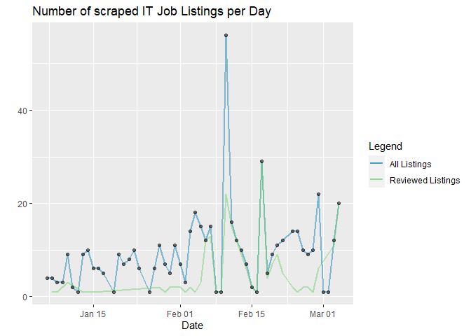
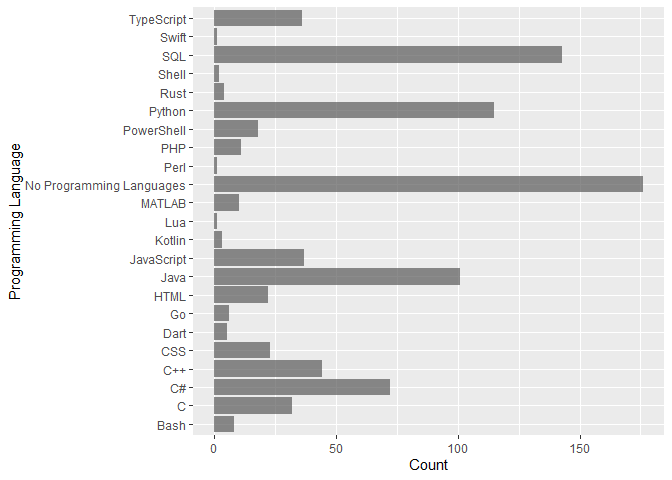

Data Analysis of IT jobs
================

Data Visualiization and Analysis from the data collected in the previous
steps from jobs.ch and itjobs.ch. Some of the job listings are rated
from a scale from 0,9 according to my interests and qualifications.

## Import Data

``` r
library(tidyverse)
library(jsonlite)
library(lubridate)
```

``` r
raw_df <- fromJSON("../data/jobs_processed.json")
raw_df <- bind_rows(raw_df)
glimpse(raw_df)
```

    ## Rows: 3,936
    ## Columns: 25
    ## $ company               <chr> NA, "BBT Software AG", "VAT Vakuumventile AG", "~
    ## $ contract_type         <chr> NA, NA, NA, "Unlimited employment", NA, NA, NA, ~
    ## $ descriptions          <list> [<data.frame[0 x 0]>], [<data.frame[1 x 1]>], [~
    ## $ downloaded            <lgl> TRUE, TRUE, TRUE, TRUE, TRUE, TRUE, TRUE, TRUE, ~
    ## $ job_title             <chr> "Bauingenieur*in (60-100%) Bereich Konstruktiver~
    ## $ language              <chr> NA, NA, NA, NA, NA, NA, NA, NA, "German (Interme~
    ## $ place_of_work         <chr> NA, "Root D4", NA, "Ringstrasse 39, 4106 Therwil~
    ## $ publication_date      <chr> NA, "06 February 2025", NA, "07 February 2025", ~
    ## $ rating                <dbl> NA, 2, NA, 6, NA, NA, NA, NA, NA, NA, NA, 4, NA,~
    ## $ reviewed              <dbl> NA, 1, NA, 1, NA, NA, NA, NA, NA, NA, NA, 1, NA,~
    ## $ salary                <chr> NA, NA, NA, NA, NA, NA, NA, NA, NA, NA, NA, NA, ~
    ## $ search_query          <chr> "data engineer", "all jobs", "software engineer"~
    ## $ url                   <chr> "https://www.jobs.ch/en/vacancies/detail/221d09c~
    ## $ website               <chr> NA, "ITJobs", "Jobs", NA, NA, NA, NA, NA, NA, "I~
    ## $ workload              <chr> NA, NA, NA, "100%", NA, NA, NA, NA, "80 – 100%",~
    ## $ career_stage_cleaned  <chr> NA, NA, NA, NA, NA, NA, NA, "senior", NA, NA, NA~
    ## $ canton                <chr> NA, NA, NA, NA, NA, NA, NA, NA, "Zürich", "Schwy~
    ## $ programming_languages <list> <>, <>, <>, <"MATLAB", "Python">, <>, <>, <>, <~
    ## $ frameworks            <list> <>, <>, <>, <>, <>, <>, <>, <>, <"Angular", "Sp~
    ## $ tools                 <list> <>, <>, <>, <>, <>, <>, <>, <>, <"Git", "Jenkin~
    ## $ operating_systems     <list> <>, <>, <>, <>, <>, <>, <>, <>, <>, <>, <>, <>,~
    ## $ years                 <list> <>, <>, <>, <>, <>, <>, <>, <>, 5, <>, <>, <>, ~
    ## $ education             <list> <>, <>, <>, "PhD", <>, <>, <>, <>, "Vocational"~
    ## $ job_title_cleaned     <chr> NA, "System Engineer", NA, "Research Engineer", ~
    ## $ job_category          <chr> NA, "Cloud/System Engineer", NA, "Software Engin~

## Clean Data

``` r
# convert datatypes
clean_df <- raw_df %>%
    mutate(publication_date = dmy(publication_date), 
        job_title_cleaned = factor(job_title_cleaned),
        career_stage_cleaned = factor(career_stage_cleaned),
        job_category = factor(job_category),
        canton = factor(canton),
        programming_languages = lapply(programming_languages, factor),
        frameworks = lapply(frameworks, factor),
        tools = lapply(tools, factor),
        operating_systems = lapply(operating_systems, factor),
        max_years = sapply(years, function(x) if (length(x) == 0) NA else max(as.numeric(x), na.rm = TRUE)), # get min number of years, and replace nan with 0
        programming_languages = ifelse(lengths(programming_languages) == 0, "No Programming Languages", programming_languages),
        frameworks = ifelse(lengths(frameworks) == 0, "No Frameworks", frameworks),
        tools = ifelse(lengths(tools) == 0, "No Tools", tools))
glimpse(clean_df)
```

    ## Rows: 3,936
    ## Columns: 26
    ## $ company               <chr> NA, "BBT Software AG", "VAT Vakuumventile AG", "~
    ## $ contract_type         <chr> NA, NA, NA, "Unlimited employment", NA, NA, NA, ~
    ## $ descriptions          <list> [<data.frame[0 x 0]>], [<data.frame[1 x 1]>], [~
    ## $ downloaded            <lgl> TRUE, TRUE, TRUE, TRUE, TRUE, TRUE, TRUE, TRUE, ~
    ## $ job_title             <chr> "Bauingenieur*in (60-100%) Bereich Konstruktiver~
    ## $ language              <chr> NA, NA, NA, NA, NA, NA, NA, NA, "German (Interme~
    ## $ place_of_work         <chr> NA, "Root D4", NA, "Ringstrasse 39, 4106 Therwil~
    ## $ publication_date      <date> NA, 2025-02-06, NA, 2025-02-07, NA, NA, NA, NA,~
    ## $ rating                <dbl> NA, 2, NA, 6, NA, NA, NA, NA, NA, NA, NA, 4, NA,~
    ## $ reviewed              <dbl> NA, 1, NA, 1, NA, NA, NA, NA, NA, NA, NA, 1, NA,~
    ## $ salary                <chr> NA, NA, NA, NA, NA, NA, NA, NA, NA, NA, NA, NA, ~
    ## $ search_query          <chr> "data engineer", "all jobs", "software engineer"~
    ## $ url                   <chr> "https://www.jobs.ch/en/vacancies/detail/221d09c~
    ## $ website               <chr> NA, "ITJobs", "Jobs", NA, NA, NA, NA, NA, NA, "I~
    ## $ workload              <chr> NA, NA, NA, "100%", NA, NA, NA, NA, "80 – 100%",~
    ## $ career_stage_cleaned  <fct> NA, NA, NA, NA, NA, NA, NA, senior, NA, NA, NA, ~
    ## $ canton                <fct> NA, NA, NA, NA, NA, NA, NA, NA, Zürich, Schwyz, ~
    ## $ programming_languages <list> "No Programming Languages", "No Programming Lan~
    ## $ frameworks            <list> "No Frameworks", "No Frameworks", "No Framework~
    ## $ tools                 <list> "No Tools", "No Tools", "No Tools", "No Tools",~
    ## $ operating_systems     <list> <>, <>, <>, <>, <>, <>, <>, <>, <>, <>, <>, <>,~
    ## $ years                 <list> <>, <>, <>, <>, <>, <>, <>, <>, 5, <>, <>, <>, ~
    ## $ education             <list> <>, <>, <>, "PhD", <>, <>, <>, <>, "Vocational"~
    ## $ job_title_cleaned     <fct> NA, System Engineer, NA, Research Engineer, NA, ~
    ## $ job_category          <fct> NA, Cloud/System Engineer, NA, Software Engineer~
    ## $ max_years             <dbl> NA, NA, NA, NA, NA, NA, NA, NA, 5, NA, NA, NA, N~

Check if some IT key words in listing title were missed during
preprocessing, and therefore have a NaN value in the `job_title_cleaned`
attribute.

``` r
clean_df %>%
  filter(is.na(job_title_cleaned)) %>%
  slice_head(n = 20) %>%
  pull(job_title) 
```

    ##  [1] "Bauingenieur*in (60-100%) Bereich Konstruktiver Wasserbau"                                  
    ##  [2] "Development Engineer Motion"                                                                
    ##  [3] "Responsable agence FS Vétroz"                                                               
    ##  [4] "2 PhD student positions in environmental soil chemistry (m/f/d)"                            
    ##  [5] "Wirtschaftsinformatikerin / Wirtschaftsinformatiker"                                        
    ##  [6] "Managing Director ETH Zurich | Space"                                                       
    ##  [7] "IT Operations Manager (w/m/d)"                                                              
    ##  [8] "Jurist:in Baurecht / Mandatsleitung 60-100%"                                                
    ##  [9] "Solution Architect:in 80–100 %"                                                             
    ## [10] "Quality Engineer"                                                                           
    ## [11] "217 .NET C# E ntwickler"                                                                    
    ## [12] "Data-Engineer/Data-Architect, 80–100 % (w/m/d)"                                             
    ## [13] "ProjektleiterIn in Schaffhausen"                                                            
    ## [14] "2 PhD Positions in Spine Biomechanics"                                                      
    ## [15] "Responsable du Service Bâtiments et Infrastructures"                                        
    ## [16] "Netzelektriker, Montage-Elektriker, Automatiker oder Polymechaniker (m/w/d) in Niedergösgen"
    ## [17] "Business Architekt/-in 80 - 100%"                                                           
    ## [18] "Responsable Qualité & Développement produits (h/f)"                                         
    ## [19] "IT Security Spezialist/-in 100%"                                                            
    ## [20] "Customer Support Engineer - Mexico, Brazil"

``` r
# drop NaN rows
df <- clean_df %>%
    filter(!is.na(job_title_cleaned) & !is.na(publication_date))%>%# drop rows with no cleaned job title, since they are probably no IT related jobs 
    filter(publication_date > as.Date("2025-01-01"))%>%
    filter(max_years <= 20) # outliers

    
glimpse(df)
```

    ## Rows: 306
    ## Columns: 26
    ## $ company               <chr> "ITech Consult AG", "Hug Engineering AG", "Persi~
    ## $ contract_type         <chr> "Freelance", "Unlimited employment", "Unlimited ~
    ## $ descriptions          <list> [<data.frame[3 x 3]>], [<data.frame[3 x 3]>], [~
    ## $ downloaded            <lgl> TRUE, TRUE, TRUE, TRUE, TRUE, TRUE, TRUE, TRUE, ~
    ## $ job_title             <chr> "Fullstack Applikationsentwickler(in) (Java, Ang~
    ## $ language              <chr> "German (Intermediate), English (Basic knowledge~
    ## $ place_of_work         <chr> "Zürich", "Im Geren 14, 8352 Elsau", "Sursee", "~
    ## $ publication_date      <date> 2025-02-05, 2025-01-08, 2025-02-03, 2025-01-16,~
    ## $ rating                <dbl> NA, NA, NA, NA, 7, NA, 2, NA, NA, NA, 4, NA, NA,~
    ## $ reviewed              <dbl> NA, NA, NA, NA, 1, NA, 1, NA, NA, NA, 1, NA, NA,~
    ## $ salary                <chr> NA, NA, NA, NA, NA, NA, NA, NA, NA, NA, NA, NA, ~
    ## $ search_query          <chr> "software engineer", "software engineer", "data ~
    ## $ url                   <chr> "https://www.jobs.ch/en/vacancies/detail/23d53c6~
    ## $ website               <chr> NA, NA, NA, NA, NA, NA, "Jobs", NA, NA, NA, "Job~
    ## $ workload              <chr> "80 – 100%", "100%", "100%", "80 – 100%", "80 – ~
    ## $ career_stage_cleaned  <fct> NA, NA, NA, NA, NA, NA, senior, NA, NA, NA, NA, ~
    ## $ canton                <fct> Zürich, NA, NA, NA, NA, NA, NA, NA, Schaffhausen~
    ## $ programming_languages <list> <Java, SQL>, <C, C++>, "No Programming Language~
    ## $ frameworks            <list> <Angular, Spring>, "No Frameworks", "No Framewo~
    ## $ tools                 <list> <Git, Jenkins>, "No Tools", "No Tools", <CI/CD,~
    ## $ operating_systems     <list> <>, <>, <>, <>, <>, <>, <>, <>, <>, <>, <>, <>,~
    ## $ years                 <list> 5, 2, 4, 3, 5, 3, <3, 5>, 2, 3, 2, <3, 5>, 5, 3~
    ## $ education             <list> "Vocational", <>, "Vocational", <>, <>, "PhD", ~
    ## $ job_title_cleaned     <fct> Applikationsentwickler, Automation Engineer, Sys~
    ## $ job_category          <fct> Software Engineer, Software Engineer, Cloud/Syst~
    ## $ max_years             <dbl> 5, 2, 4, 3, 5, 3, 5, 2, 3, 2, 5, 5, 3, 5, 3, 2, ~

## Visualize

``` r
df %>%
    count(publication_date) %>%
    ggplot(aes(publication_date, n)) +
    geom_line(aes(color = "All Listings"), linewidth = 1, alpha=0.5) +  # Line for all listings
    geom_line(data = df %>% filter(reviewed == TRUE) %>% count(publication_date), 
            aes(publication_date, n, color = "Reviewed Listings"), linewidth = 1, alpha=0.5) +  # Line for reviewed listings
    geom_point(aes(publication_date, n), alpha=0.5)+
    labs(title = "Number of scraped IT Job Listings per Day",
        x = "Date",
        y = "") +
    scale_color_manual(name = "Legend", values = c("All Listings" = "blue", "Reviewed Listings" = "green"))
```

<!-- -->

``` r
df %>%
  ggplot() +
  geom_bar(mapping=aes(x=rating), alpha = 0.7)+
  labs(x = "Rating",
       y = "Count") 
```

    ## Warning: Removed 205 rows containing non-finite values (`stat_count()`).

<!-- -->

``` r
df %>%
  ggplot() +
  geom_bar(mapping=aes(y=job_category), alpha = 0.7)+
  labs(y = "Job Category",
       x = "Count") 
```

<!-- -->

``` r
p <- ggplot(df, aes(max_years, career_stage_cleaned))  +
    geom_boxplot() +
    labs(y = "Career Stage",
        x = "Min years of experience") 
print(p)
```

<!-- -->

``` r
df %>%
    unnest(programming_languages) %>%         # Unnest the list column
    count(programming_languages) %>%           # Count occurrences of each language
    ggplot(aes(x = n, y = programming_languages)) +  
    geom_bar(stat = "identity", alpha = 0.7) +
    labs(x = "Count", y = "Programming Language")
```

<!-- -->

``` r
df %>%
    unnest(programming_languages) %>% 
    ggplot(aes(x = rating , y = programming_languages)) +
    geom_boxplot() +
    labs(x = "Rating", y = "Programming Languages")
```

    ## Warning: Removed 353 rows containing non-finite values (`stat_boxplot()`).

<!-- -->

``` r
df %>%
    count(search_query) 
```

    ##        search_query   n
    ## 1          all jobs  38
    ## 2     data engineer  82
    ## 3    data scientist   9
    ## 4 software engineer 177

``` r
df %>%
    count(job_title_cleaned) %>%
    arrange(desc(n))
```

    ##            job_title_cleaned  n
    ## 1          Software Engineer 62
    ## 2            System Engineer 46
    ## 3         Software Developer 14
    ## 4              Data Engineer 10
    ## 5            DevOps Engineer 10
    ## 6        Automation Engineer  9
    ## 7          Security Engineer  9
    ## 8         Softwareentwickler  9
    ## 9              Entwickler:in  8
    ## 10          Systems Engineer  8
    ## 11      Application Engineer  7
    ## 12              Data Analyst  6
    ## 13          Network Engineer  6
    ## 14       Software Entwickler  6
    ## 15            Cloud Engineer  5
    ## 16           Design Engineer  5
    ## 17        Frontend Developer  5
    ## 18     Requirements Engineer  5
    ## 19         Platform Engineer  4
    ## 20        Software Architect  4
    ## 21         Solution Engineer  4
    ## 22             Test Engineer  4
    ## 23        Fullstack Engineer  3
    ## 24             ICT-Architekt  3
    ## 25             ICT Architekt  3
    ## 26          Projektleiter:in  3
    ## 27 Site Reliability Engineer  3
    ## 28               AI Engineer  2
    ## 29    Applikationsentwickler  2
    ## 30         Backend Developer  2
    ## 31            Data Scientist  2
    ## 32         Frontend Engineer  2
    ## 33      Full Stack Developer  2
    ## 34      Fullstack Entwickler  2
    ## 35                       R&D  2
    ## 36          Senior Developer  2
    ## 37          Softwareengineer  2
    ## 38           Systemingenieur  2
    ## 39         Angular Developer  1
    ## 40          Backend Engineer  1
    ## 41           Cloud-Architekt  1
    ## 42           Cloud Architect  1
    ## 43           Computer Vision  1
    ## 44    Cybersecurity Engineer  1
    ## 45                 Data & AI  1
    ## 46            Data Architect  1
    ## 47         Database Engineer  1
    ## 48       Fullstack Developer  1
    ## 49       IT-Security Manager  1
    ## 50             IT Management  1
    ## 51            Java Developer  1
    ## 52       Middleware Engineer  1
    ## 53         Research Engineer  1
    ## 54       Salesforce Engineer  1
    ## 55       Software-Entwickler  1
    ## 56         Softwarearchitekt  1
    ## 57          Storage Engineer  1
    ## 58             Teamlead Data  1
    ## 59            Technical Lead  1
    ## 60               UX Designer  1
    ## 61             Web Developer  1

``` r
df %>%
    count(job_category) %>%
    ggplot(aes(x = n, y = job_category)) +
    geom_bar(stat = "identity")
```

<!-- -->

``` r
df %>%
    ggplot(aes(x = rating , y = job_category)) +
    geom_boxplot(alpha = 0.7) +
    labs(x = "Rating", y = "Job Category")
```

    ## Warning: Removed 205 rows containing non-finite values (`stat_boxplot()`).

<!-- -->

``` r
df %>%
    ggplot(aes(x = rating , y = canton)) +
    geom_boxplot(alpha = 0.7) +
    labs(x = "Rating", y = "Canton")
```

    ## Warning: Removed 205 rows containing non-finite values (`stat_boxplot()`).

<!-- -->

``` r
df %>%
    ggplot(aes(x = max_years, y = rating )) +
    geom_point(alpha = 0.7) +
    geom_smooth(method = "lm", se = FALSE, color = "blue") +
    labs(x = "Max Years of Experience", y = " Rating", title = "Correlation between Rating and Max Years of Experience")
```

    ## `geom_smooth()` using formula = 'y ~ x'

    ## Warning: Removed 205 rows containing non-finite values (`stat_smooth()`).

    ## Warning: Removed 205 rows containing missing values (`geom_point()`).

<!-- -->

## Fit Model

``` r
df_one_hot <- df %>%
    select(url, job_category, career_stage_cleaned, programming_languages, frameworks, max_years, rating ) %>%
    mutate(programming_languages = lapply(programming_languages, factor)) %>%
    unnest(programming_languages) %>%
    distinct() %>%
    mutate(temp = 1) %>%
    pivot_wider(names_from = programming_languages, values_from = temp, values_fill = list(temp = 0))%>%
    unnest(frameworks) %>%
    distinct() %>%
    mutate(temp = 1) %>%
    pivot_wider(names_from = frameworks, values_from = temp, values_fill = list(temp = 0))

    

glimpse(df_one_hot)
```

    ## Rows: 306
    ## Columns: 43
    ## $ url                        <chr> "https://www.jobs.ch/en/vacancies/detail/23~
    ## $ job_category               <fct> Software Engineer, Software Engineer, Cloud~
    ## $ career_stage_cleaned       <fct> NA, NA, NA, NA, NA, NA, senior, NA, NA, NA,~
    ## $ max_years                  <dbl> 5, 2, 4, 3, 5, 3, 5, 2, 3, 2, 5, 5, 3, 5, 3~
    ## $ rating                     <dbl> NA, NA, NA, NA, 7, NA, 2, NA, NA, NA, 4, NA~
    ## $ Java                       <dbl> 1, 0, 0, 0, 0, 0, 0, 0, 0, 0, 0, 0, 0, 1, 1~
    ## $ SQL                        <dbl> 1, 0, 0, 0, 1, 0, 0, 1, 0, 0, 0, 1, 0, 1, 1~
    ## $ C                          <dbl> 0, 1, 0, 0, 0, 1, 0, 0, 0, 0, 0, 0, 0, 0, 0~
    ## $ `C++`                      <dbl> 0, 1, 0, 0, 0, 1, 0, 0, 1, 0, 0, 0, 0, 0, 0~
    ## $ `No Programming Languages` <dbl> 0, 0, 1, 0, 0, 0, 0, 0, 0, 1, 0, 0, 0, 0, 0~
    ## $ `C#`                       <dbl> 0, 0, 0, 1, 0, 0, 0, 0, 0, 0, 0, 0, 1, 0, 0~
    ## $ Python                     <dbl> 0, 0, 0, 1, 0, 0, 1, 0, 0, 0, 1, 1, 0, 0, 0~
    ## $ MATLAB                     <dbl> 0, 0, 0, 0, 0, 1, 0, 0, 0, 0, 0, 0, 0, 0, 0~
    ## $ Shell                      <dbl> 0, 0, 0, 0, 0, 0, 1, 0, 0, 0, 0, 0, 0, 0, 0~
    ## $ Lua                        <dbl> 0, 0, 0, 0, 0, 0, 0, 0, 1, 0, 0, 0, 0, 0, 0~
    ## $ CSS                        <dbl> 0, 0, 0, 0, 0, 0, 0, 0, 0, 0, 0, 0, 1, 0, 0~
    ## $ HTML                       <dbl> 0, 0, 0, 0, 0, 0, 0, 0, 0, 0, 0, 0, 1, 0, 1~
    ## $ TypeScript                 <dbl> 0, 0, 0, 0, 0, 0, 0, 0, 0, 0, 0, 0, 1, 0, 1~
    ## $ JavaScript                 <dbl> 0, 0, 0, 0, 0, 0, 0, 0, 0, 0, 0, 0, 0, 0, 1~
    ## $ Bash                       <dbl> 0, 0, 0, 0, 0, 0, 0, 0, 0, 0, 0, 0, 0, 0, 0~
    ## $ Go                         <dbl> 0, 0, 0, 0, 0, 0, 0, 0, 0, 0, 0, 0, 0, 0, 0~
    ## $ PowerShell                 <dbl> 0, 0, 0, 0, 0, 0, 0, 0, 0, 0, 0, 0, 0, 0, 0~
    ## $ Kotlin                     <dbl> 0, 0, 0, 0, 0, 0, 0, 0, 0, 0, 0, 0, 0, 0, 0~
    ## $ PHP                        <dbl> 0, 0, 0, 0, 0, 0, 0, 0, 0, 0, 0, 0, 0, 0, 0~
    ## $ Dart                       <dbl> 0, 0, 0, 0, 0, 0, 0, 0, 0, 0, 0, 0, 0, 0, 0~
    ## $ Perl                       <dbl> 0, 0, 0, 0, 0, 0, 0, 0, 0, 0, 0, 0, 0, 0, 0~
    ## $ Rust                       <dbl> 0, 0, 0, 0, 0, 0, 0, 0, 0, 0, 0, 0, 0, 0, 0~
    ## $ Swift                      <dbl> 0, 0, 0, 0, 0, 0, 0, 0, 0, 0, 0, 0, 0, 0, 0~
    ## $ Angular                    <dbl> 1, 0, 0, 0, 0, 0, 0, 0, 0, 0, 0, 0, 0, 0, 1~
    ## $ Spring                     <dbl> 1, 0, 0, 0, 0, 0, 0, 0, 0, 0, 0, 0, 0, 1, 1~
    ## $ `No Frameworks`            <dbl> 0, 1, 1, 0, 1, 1, 1, 1, 1, 1, 1, 1, 0, 0, 0~
    ## $ React                      <dbl> 0, 0, 0, 1, 0, 0, 0, 0, 0, 0, 0, 0, 1, 0, 1~
    ## $ Next.js                    <dbl> 0, 0, 0, 0, 0, 0, 0, 0, 0, 0, 0, 0, 1, 0, 0~
    ## $ Vue                        <dbl> 0, 0, 0, 0, 0, 0, 0, 0, 0, 0, 0, 0, 0, 0, 1~
    ## $ .NET                       <dbl> 0, 0, 0, 0, 0, 0, 0, 0, 0, 0, 0, 0, 0, 0, 0~
    ## $ ASP.NET                    <dbl> 0, 0, 0, 0, 0, 0, 0, 0, 0, 0, 0, 0, 0, 0, 0~
    ## $ Node.js                    <dbl> 0, 0, 0, 0, 0, 0, 0, 0, 0, 0, 0, 0, 0, 0, 0~
    ## $ NestJS                     <dbl> 0, 0, 0, 0, 0, 0, 0, 0, 0, 0, 0, 0, 0, 0, 0~
    ## $ Svelte                     <dbl> 0, 0, 0, 0, 0, 0, 0, 0, 0, 0, 0, 0, 0, 0, 0~
    ## $ Django                     <dbl> 0, 0, 0, 0, 0, 0, 0, 0, 0, 0, 0, 0, 0, 0, 0~
    ## $ FastAPI                    <dbl> 0, 0, 0, 0, 0, 0, 0, 0, 0, 0, 0, 0, 0, 0, 0~
    ## $ Symfony                    <dbl> 0, 0, 0, 0, 0, 0, 0, 0, 0, 0, 0, 0, 0, 0, 0~
    ## $ Laravel                    <dbl> 0, 0, 0, 0, 0, 0, 0, 0, 0, 0, 0, 0, 0, 0, 0~

``` r
df_model <- df_one_hot %>% filter(!is.na(rating))
df_to_predict <- df_one_hot %>% filter(is.na(rating))
set.seed(1)
sample <- sample(c(TRUE, FALSE), nrow(df_model), replace=TRUE, prob=c(0.8,0.2))
train  <- df_model[sample, ]
test   <- df_model[!sample, ]

# Fit a linear regression model
model <- lm(rating ~ . - url, data = train)


summary(model)
```

    ## 
    ## Call:
    ## lm(formula = rating ~ . - url, data = train)
    ## 
    ## Residuals:
    ##          2          4         11         14         16         17         34 
    ## -2.671e-16  1.328e-15 -1.468e-15  1.500e+00  8.149e-16  1.301e-15 -5.000e-01 
    ##         35         44         46         48         49         54         57 
    ## -4.480e-16  1.000e+00 -1.149e-16  1.071e-16  3.014e-16  1.217e-15 -1.225e-15 
    ##         58         59         63         65         72         80 
    ## -3.647e-16 -1.500e+00 -2.537e-16 -1.000e+00  5.000e-01 -1.337e-15 
    ## 
    ## Coefficients: (31 not defined because of singularities)
    ##                                     Estimate Std. Error t value Pr(>|t|)  
    ## (Intercept)                           2.1000     2.6510   0.792   0.4642  
    ## job_categoryConsulting & Management  -0.9000     1.3594  -0.662   0.5372  
    ## job_categoryData Engineer             4.4000     1.5962   2.756   0.0400 *
    ## job_categoryDesign                   -2.0000     1.4491  -1.380   0.2261  
    ## job_categoryInfrastructure            3.4000     2.6510   1.283   0.2559  
    ## job_categorySoftware Engineer         2.4000     3.3299   0.721   0.5033  
    ## career_stage_cleanedsenior           -4.5000     2.0494  -2.196   0.0795 .
    ## max_years                             0.2000     0.3347   0.598   0.5761  
    ## Java                                  2.0000     2.5100   0.797   0.4617  
    ## SQL                                   1.0000     1.6733   0.598   0.5761  
    ## C                                     3.8000     4.5024   0.844   0.4372  
    ## `C++`                                -1.2000     1.4873  -0.807   0.4564  
    ## `No Programming Languages`            3.4000     2.2199   1.532   0.1862  
    ## `C#`                                      NA         NA      NA       NA  
    ## Python                                    NA         NA      NA       NA  
    ## MATLAB                                    NA         NA      NA       NA  
    ## Shell                                     NA         NA      NA       NA  
    ## Lua                                       NA         NA      NA       NA  
    ## CSS                                   2.4000     3.4334   0.699   0.5157  
    ## HTML                                      NA         NA      NA       NA  
    ## TypeScript                                NA         NA      NA       NA  
    ## JavaScript                                NA         NA      NA       NA  
    ## Bash                                      NA         NA      NA       NA  
    ## Go                                        NA         NA      NA       NA  
    ## PowerShell                                NA         NA      NA       NA  
    ## Kotlin                                    NA         NA      NA       NA  
    ## PHP                                       NA         NA      NA       NA  
    ## Dart                                      NA         NA      NA       NA  
    ## Perl                                      NA         NA      NA       NA  
    ## Rust                                      NA         NA      NA       NA  
    ## Swift                                     NA         NA      NA       NA  
    ## Angular                               1.6000     1.9514   0.820   0.4496  
    ## Spring                                    NA         NA      NA       NA  
    ## `No Frameworks`                           NA         NA      NA       NA  
    ## React                                     NA         NA      NA       NA  
    ## Next.js                                   NA         NA      NA       NA  
    ## Vue                                       NA         NA      NA       NA  
    ## .NET                                      NA         NA      NA       NA  
    ## ASP.NET                                   NA         NA      NA       NA  
    ## Node.js                                   NA         NA      NA       NA  
    ## NestJS                                    NA         NA      NA       NA  
    ## Svelte                                    NA         NA      NA       NA  
    ## Django                                    NA         NA      NA       NA  
    ## FastAPI                                   NA         NA      NA       NA  
    ## Symfony                                   NA         NA      NA       NA  
    ## Laravel                                   NA         NA      NA       NA  
    ## ---
    ## Signif. codes:  0 '***' 0.001 '**' 0.01 '*' 0.05 '.' 0.1 ' ' 1
    ## 
    ## Residual standard error: 1.183 on 5 degrees of freedom
    ##   (64 observations deleted due to missingness)
    ## Multiple R-squared:  0.8955, Adjusted R-squared:  0.603 
    ## F-statistic: 3.061 on 14 and 5 DF,  p-value: 0.1114

## Predict

``` r
df_to_predict_no_url <- df_to_predict %>% select(-url)

# Align factor levels with training data
for (col in names(df_to_predict_no_url)) {
  if (is.factor(df_to_predict_no_url[[col]])) {
    df_to_predict_no_url[[col]] <- factor(df_to_predict_no_url[[col]], levels = levels(droplevels(train[[col]])))
  }
}

# Make predictions 
predictions <- predict(model, newdata = df_to_predict_no_url)
```

    ## Error in model.frame.default(Terms, newdata, na.action = na.action, xlev = object$xlevels): object is not a matrix

``` r
df_to_predict$predicted_rating <- predictions
```

    ## Error in eval(expr, envir, enclos): object 'predictions' not found

``` r
highest_predicted_ratings <- df_to_predict %>%
    arrange(desc(predicted_rating))%>%
    select(url, predicted_rating) %>%
    slice_head(n = 10)  
```

    ## Error in `arrange()`:
    ## i In argument: `..1 = predicted_rating`.
    ## Caused by error:
    ## ! object 'predicted_rating' not found

``` r
highest_predicted_ratings
```

    ## Error in eval(expr, envir, enclos): object 'highest_predicted_ratings' not found
