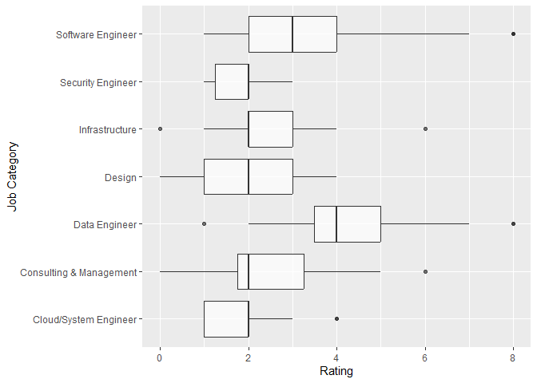

Data Analysis of IT jobs
================

Data Visualiization and Analysis from the data collected in the previous
steps from jobs.ch and itjobs.ch. Some of the job listings are rated
from a scale from 0,9 according to my interests and qualifications.

## Import Data

``` r
library(tidyverse)
library(jsonlite)
library(lubridate)
```

``` r
raw_df <- fromJSON("../data/jobs_processed.json")
raw_df <- bind_rows(raw_df)
raw_df <- tibble(raw_df)
glimpse(raw_df)
```

    ## Rows: 5,456
    ## Columns: 25
    ## $ company               <chr> NA, "BBT Software AG", "VAT Vakuumventile AG", "~
    ## $ contract_type         <chr> NA, NA, NA, "Unlimited employment", NA, NA, NA, ~
    ## $ descriptions          <list> [<data.frame[0 x 0]>], [<data.frame[1 x 1]>], [~
    ## $ downloaded            <lgl> TRUE, TRUE, TRUE, TRUE, TRUE, TRUE, TRUE, TRUE, ~
    ## $ job_title             <chr> "Bauingenieur*in (60-100%) Bereich Konstruktiver~
    ## $ language              <chr> NA, NA, NA, NA, NA, NA, NA, NA, "German (Interme~
    ## $ place_of_work         <chr> NA, "Root D4", NA, "Ringstrasse 39, 4106 Therwil~
    ## $ publication_date      <chr> NA, "06 February 2025", NA, "07 February 2025", ~
    ## $ rating                <dbl> NA, 2, NA, 6, NA, NA, NA, NA, 6, NA, NA, 4, NA, ~
    ## $ reviewed              <dbl> NA, 1, NA, 1, NA, NA, NA, NA, 1, NA, NA, 1, NA, ~
    ## $ salary                <chr> NA, NA, NA, NA, NA, NA, NA, NA, NA, NA, NA, NA, ~
    ## $ search_query          <chr> "data engineer", "all jobs", "software engineer"~
    ## $ url                   <chr> "https://www.jobs.ch/en/vacancies/detail/221d09c~
    ## $ website               <chr> NA, "ITJobs", "Jobs", NA, NA, NA, NA, NA, NA, "I~
    ## $ workload              <chr> NA, NA, NA, "100%", NA, NA, NA, NA, "80 – 100%",~
    ## $ career_stage_cleaned  <chr> NA, NA, NA, NA, NA, NA, NA, "senior", NA, NA, NA~
    ## $ canton                <chr> NA, NA, NA, NA, NA, NA, NA, NA, "Zürich", "Schwy~
    ## $ programming_languages <list> <>, <>, <>, <"MATLAB", "Python">, <>, <>, <>, <~
    ## $ frameworks            <list> <>, <>, <>, <>, <>, <>, <>, <>, <"Angular", "Sp~
    ## $ tools                 <list> <>, <>, <>, <>, <>, <>, <>, <>, <"Git", "Jenkin~
    ## $ operating_systems     <list> <>, <>, <>, <>, <>, <>, <>, <>, <>, <>, <>, <>,~
    ## $ years                 <list> <>, <>, <>, <>, <>, <>, <>, <>, 5, <>, <>, <>, ~
    ## $ education             <list> <>, <>, <>, "PhD", <>, <>, <>, <>, "Vocational"~
    ## $ job_title_cleaned     <chr> NA, "System Engineer", NA, "Research Engineer", ~
    ## $ job_category          <chr> NA, "Cloud/System Engineer", NA, "Software Engin~

## Clean Data

``` r
# convert datatypes
clean_df <- raw_df %>%
    mutate(publication_date = dmy(publication_date), 
        job_title_cleaned = factor(job_title_cleaned),
        career_stage_cleaned = factor(career_stage_cleaned),
        job_category = factor(job_category),
        canton = factor(canton),
        programming_languages = lapply(programming_languages, factor),
        frameworks = lapply(frameworks, factor),
        tools = lapply(tools, factor),
        operating_systems = lapply(operating_systems, factor),
        max_years = sapply(years, function(x) if (length(x) == 0) NA else max(as.numeric(x), na.rm = TRUE)), # get min number of years, and replace nan with 0
        programming_languages = ifelse(lengths(programming_languages) == 0, "No Programming Languages", programming_languages),
        frameworks = ifelse(lengths(frameworks) == 0, "No Frameworks", frameworks),
        tools = ifelse(lengths(tools) == 0, "No Tools", tools))
glimpse(clean_df)
```

    ## Rows: 5,456
    ## Columns: 26
    ## $ company               <chr> NA, "BBT Software AG", "VAT Vakuumventile AG", "~
    ## $ contract_type         <chr> NA, NA, NA, "Unlimited employment", NA, NA, NA, ~
    ## $ descriptions          <list> [<data.frame[0 x 0]>], [<data.frame[1 x 1]>], [~
    ## $ downloaded            <lgl> TRUE, TRUE, TRUE, TRUE, TRUE, TRUE, TRUE, TRUE, ~
    ## $ job_title             <chr> "Bauingenieur*in (60-100%) Bereich Konstruktiver~
    ## $ language              <chr> NA, NA, NA, NA, NA, NA, NA, NA, "German (Interme~
    ## $ place_of_work         <chr> NA, "Root D4", NA, "Ringstrasse 39, 4106 Therwil~
    ## $ publication_date      <date> NA, 2025-02-06, NA, 2025-02-07, NA, NA, NA, NA,~
    ## $ rating                <dbl> NA, 2, NA, 6, NA, NA, NA, NA, 6, NA, NA, 4, NA, ~
    ## $ reviewed              <dbl> NA, 1, NA, 1, NA, NA, NA, NA, 1, NA, NA, 1, NA, ~
    ## $ salary                <chr> NA, NA, NA, NA, NA, NA, NA, NA, NA, NA, NA, NA, ~
    ## $ search_query          <chr> "data engineer", "all jobs", "software engineer"~
    ## $ url                   <chr> "https://www.jobs.ch/en/vacancies/detail/221d09c~
    ## $ website               <chr> NA, "ITJobs", "Jobs", NA, NA, NA, NA, NA, NA, "I~
    ## $ workload              <chr> NA, NA, NA, "100%", NA, NA, NA, NA, "80 – 100%",~
    ## $ career_stage_cleaned  <fct> NA, NA, NA, NA, NA, NA, NA, senior, NA, NA, NA, ~
    ## $ canton                <fct> NA, NA, NA, NA, NA, NA, NA, NA, Zürich, Schwyz, ~
    ## $ programming_languages <list> "No Programming Languages", "No Programming Lan~
    ## $ frameworks            <list> "No Frameworks", "No Frameworks", "No Framework~
    ## $ tools                 <list> "No Tools", "No Tools", "No Tools", "No Tools",~
    ## $ operating_systems     <list> <>, <>, <>, <>, <>, <>, <>, <>, <>, <>, <>, <>,~
    ## $ years                 <list> <>, <>, <>, <>, <>, <>, <>, <>, 5, <>, <>, <>, ~
    ## $ education             <list> <>, <>, <>, "PhD", <>, <>, <>, <>, "Vocational"~
    ## $ job_title_cleaned     <fct> NA, System Engineer, NA, Research Engineer, NA, ~
    ## $ job_category          <fct> NA, Cloud/System Engineer, NA, Software Engineer~
    ## $ max_years             <dbl> NA, NA, NA, NA, NA, NA, NA, NA, 5, NA, NA, NA, N~

Check if some IT key words in listing title were missed during
preprocessing, and therefore have a NaN value in the `job_title_cleaned`
attribute.

``` r
clean_df %>%
  filter(is.na(job_title_cleaned)) %>%
  slice_head(n = 20) %>%
  pull(job_title) 
```

    ##  [1] "Bauingenieur*in (60-100%) Bereich Konstruktiver Wasserbau"                                  
    ##  [2] "Development Engineer Motion"                                                                
    ##  [3] "Responsable agence FS Vétroz"                                                               
    ##  [4] "2 PhD student positions in environmental soil chemistry (m/f/d)"                            
    ##  [5] "Wirtschaftsinformatikerin / Wirtschaftsinformatiker"                                        
    ##  [6] "Managing Director ETH Zurich | Space"                                                       
    ##  [7] "IT Operations Manager (w/m/d)"                                                              
    ##  [8] "Jurist:in Baurecht / Mandatsleitung 60-100%"                                                
    ##  [9] "Solution Architect:in 80–100 %"                                                             
    ## [10] "Quality Engineer"                                                                           
    ## [11] "217 .NET C# E ntwickler"                                                                    
    ## [12] "Data-Engineer/Data-Architect, 80–100 % (w/m/d)"                                             
    ## [13] "ProjektleiterIn in Schaffhausen"                                                            
    ## [14] "2 PhD Positions in Spine Biomechanics"                                                      
    ## [15] "Responsable du Service Bâtiments et Infrastructures"                                        
    ## [16] "Netzelektriker, Montage-Elektriker, Automatiker oder Polymechaniker (m/w/d) in Niedergösgen"
    ## [17] "Business Architekt/-in 80 - 100%"                                                           
    ## [18] "Responsable Qualité & Développement produits (h/f)"                                         
    ## [19] "IT Security Spezialist/-in 100%"                                                            
    ## [20] "Customer Support Engineer - Mexico, Brazil"

Keep only data with recognized IT- Keywords. Other job listings are
probably not IT related.

``` r
# drop NaN rows
df <- clean_df %>%
    filter(!is.na(job_title_cleaned) & !is.na(publication_date))%>%
    filter(publication_date > as.Date("2025-01-01"))%>%
    filter(max_years <= 20) # outliers

    
glimpse(df)
```

    ## Rows: 513
    ## Columns: 26
    ## $ company               <chr> "ITech Consult AG", "Hug Engineering AG", "Persi~
    ## $ contract_type         <chr> "Freelance", "Unlimited employment", "Unlimited ~
    ## $ descriptions          <list> [<data.frame[3 x 3]>], [<data.frame[3 x 3]>], [~
    ## $ downloaded            <lgl> TRUE, TRUE, TRUE, TRUE, TRUE, TRUE, TRUE, TRUE, ~
    ## $ job_title             <chr> "Fullstack Applikationsentwickler(in) (Java, Ang~
    ## $ language              <chr> "German (Intermediate), English (Basic knowledge~
    ## $ place_of_work         <chr> "Zürich", "Im Geren 14, 8352 Elsau", "Sursee", "~
    ## $ publication_date      <date> 2025-02-05, 2025-01-08, 2025-02-03, 2025-01-16,~
    ## $ rating                <dbl> 6, NA, NA, NA, 7, NA, 2, NA, NA, NA, 4, NA, 8, N~
    ## $ reviewed              <dbl> 1, NA, NA, NA, 1, NA, 1, NA, NA, NA, 1, NA, 1, N~
    ## $ salary                <chr> NA, NA, NA, NA, NA, NA, NA, NA, NA, NA, NA, NA, ~
    ## $ search_query          <chr> "software engineer", "software engineer", "data ~
    ## $ url                   <chr> "https://www.jobs.ch/en/vacancies/detail/23d53c6~
    ## $ website               <chr> NA, NA, NA, NA, NA, NA, "Jobs", NA, NA, NA, "Job~
    ## $ workload              <chr> "80 – 100%", "100%", "100%", "80 – 100%", "80 – ~
    ## $ career_stage_cleaned  <fct> NA, NA, NA, NA, NA, NA, senior, NA, NA, NA, NA, ~
    ## $ canton                <fct> Zürich, NA, NA, NA, NA, NA, NA, NA, Schaffhausen~
    ## $ programming_languages <list> <Java, SQL>, <C, C++>, "No Programming Language~
    ## $ frameworks            <list> <Angular, Spring>, "No Frameworks", "No Framewo~
    ## $ tools                 <list> <Git, Jenkins>, "No Tools", "No Tools", <CI/CD,~
    ## $ operating_systems     <list> <>, <>, <>, <>, <>, <>, <>, <>, <>, <>, <>, <>,~
    ## $ years                 <list> 5, 2, 4, 3, 5, 3, <3, 5>, 2, 3, 2, <3, 5>, 5, 3~
    ## $ education             <list> "Vocational", <>, "Vocational", <>, <>, "PhD", ~
    ## $ job_title_cleaned     <fct> Applikationsentwickler, Automation Engineer, Sys~
    ## $ job_category          <fct> Software Engineer, Software Engineer, Cloud/Syst~
    ## $ max_years             <dbl> 5, 2, 4, 3, 5, 3, 5, 2, 3, 2, 5, 5, 3, 5, 3, 2, ~

## Visualize

Interesting to see the Sunndays with mostly zero job postings. Most
postings are on Mondays and Thuesdays.

``` r
df %>%
    count(publication_date) %>%
    ggplot(aes(publication_date, n)) +
    geom_line(aes(color = "All Listings"), linewidth = 1, alpha=0.5) +  # Line for all listings
    geom_line(data = df %>% filter(reviewed == TRUE) %>% count(publication_date), 
            aes(publication_date, n, color = "Reviewed Listings"), linewidth = 1, alpha=0.5) +  # Line for reviewed listings
    geom_point(aes(publication_date, n), alpha=0.5)+
    labs(title = "Number of scraped IT Job Listings per Day",
        x = "Date",
        y = "") +
    scale_color_manual(name = "Legend", values = c("All Listings" = "#1182ba", "Reviewed Listings" = "#71d171"))
```

<!-- -->

``` r
df %>%
  ggplot() +
  geom_bar(mapping=aes(x=rating), alpha = 0.7)+
  labs(x = "Rating",
       y = "Count") 
```

    ## Warning: Removed 298 rows containing non-finite values (`stat_count()`).

<!-- --> Most Jobs
are in the broad cattegory of Software Engineering, where some keywords
of this category are: “Software Engineer”, “Software Developer”,
“Full-Stack Developer”, “Applikationsentwickler/in”… Seccond most jobs
are in the category of Cloud/System Engineering, where some keywords of
this category are: “Cloud Engineer”, “Cloud Architect”, “Site
Reliability Engineer”, “System Engineer”, “Systemadministrator”…

``` r
df %>%
  ggplot() +
  geom_bar(mapping=aes(y=job_category), alpha = 0.7)+
  labs(y = "Job Category",
       x = "Count") 
```

<!-- --> There are
very few explicit junior positions. Senior positions have a mean of 3.9
years of experience, and positions with no explicit career stage have a
mean of 3.1 years. Note there are some outliers.

``` r
df %>%
  group_by(career_stage_cleaned) %>%
  summarise(count = n(), mean_max_years = mean(max_years, na.rm = TRUE))
```

    ## # A tibble: 3 x 3
    ##   career_stage_cleaned count mean_max_years
    ##   <fct>                <int>          <dbl>
    ## 1 junior                   8           2.38
    ## 2 senior                 173           3.97
    ## 3 <NA>                   332           3.16

Junior positions, except for one outlier, always have zero years of
required experience, which makes sense.

``` r
df %>% 
    ggplot(aes(x = max_years, y = career_stage_cleaned)) +
    geom_boxplot() +
    labs(y = "Career Stage",
         x = "Max years of experience",
         title = "Career Stage vs. Max Years of Experience with Mean Points")
```

<!-- -->

``` r
df %>%
    unnest(programming_languages) %>%         # Unnest the list column
    count(programming_languages) %>%           # Count occurrences of each language
    ggplot(aes(x = n, y = programming_languages)) +  
    geom_bar(stat = "identity", alpha = 0.7) +
    labs(x = "Count", y = "Programming Language")
```

<!-- -->

``` r
df %>%
    unnest(programming_languages) %>% 
    ggplot(aes(x = rating , y = programming_languages)) +
    geom_boxplot() +
    labs(x = "Rating", y = "Programming Languages")
```

    ## Warning: Removed 503 rows containing non-finite values (`stat_boxplot()`).

<!-- -->

``` r
df %>%
    count(search_query) 
```

    ## # A tibble: 4 x 2
    ##   search_query          n
    ##   <chr>             <int>
    ## 1 all jobs             50
    ## 2 data engineer       109
    ## 3 data scientist       15
    ## 4 software engineer   339

``` r
df %>%
    count(job_title_cleaned) %>%
    arrange(desc(n))
```

    ## # A tibble: 77 x 2
    ##    job_title_cleaned           n
    ##    <fct>                   <int>
    ##  1 Software Engineer         103
    ##  2 System Engineer            64
    ##  3 Data Engineer              53
    ##  4 Software Developer         19
    ##  5 Application Engineer       15
    ##  6 DevOps Engineer            14
    ##  7 Software Entwickler        13
    ##  8 Wirtschaftsinformatiker    13
    ##  9 Data Scientist             12
    ## 10 Softwareentwickler         12
    ## # i 67 more rows

``` r
df %>%
    count(job_category) %>%
    ggplot(aes(x = n, y = job_category)) +
    geom_bar(stat = "identity")
```

<!-- -->

``` r
df %>%
    ggplot(aes(x = rating , y = job_category)) +
    geom_boxplot(alpha = 0.7) +
    labs(x = "Rating", y = "Job Category")
```

    ## Warning: Removed 298 rows containing non-finite values (`stat_boxplot()`).

<!-- -->

``` r
df %>%
    ggplot(aes(x = rating , y = canton)) +
    geom_boxplot(alpha = 0.7) +
    labs(x = "Rating", y = "Canton")
```

    ## Warning: Removed 298 rows containing non-finite values (`stat_boxplot()`).

<!-- -->

``` r
df %>%
    ggplot(aes(x = max_years, y = rating )) +
    geom_point(alpha = 0.7) +
    geom_smooth(method = "lm", se = FALSE, color = "blue") +
    labs(x = "Max Years of Experience", y = " Rating", title = "Correlation between Rating and Max Years of Experience")
```

    ## `geom_smooth()` using formula = 'y ~ x'

    ## Warning: Removed 298 rows containing non-finite values (`stat_smooth()`).

    ## Warning: Removed 298 rows containing missing values (`geom_point()`).

<!-- -->

## Fit Model

- Linear model is probably not the best for this usecase, classification
  with kNN / SVM might be more appropriate (TODO)

``` r
df_one_hot <- df %>%
    select(job_title, url, job_category, career_stage_cleaned, programming_languages, frameworks, max_years, rating ) %>% 
    # handle NA values as an "Non Value" factor
    mutate(
        job_category = factor(replace_na(as.character(job_category), "No Value")),
        career_stage_cleaned = factor(replace_na(as.character(career_stage_cleaned), "No Value")))
    
df_one_hot <- df_one_hot%>% 
    mutate(programming_languages = lapply(programming_languages, factor)) %>%
    unnest(programming_languages) %>%
    distinct() %>%
    mutate(temp = 1) %>%
    pivot_wider(names_from = programming_languages, values_from = temp, values_fill = list(temp = 0))


df_one_hot <- df_one_hot %>%   
    unnest(frameworks) %>%
    distinct() %>%
    mutate(temp = 1) %>%
    pivot_wider(names_from = frameworks, values_from = temp, values_fill = list(temp = 0))


glimpse(df_one_hot)
```

    ## Rows: 513
    ## Columns: 44
    ## $ job_title                  <chr> "Fullstack Applikationsentwickler(in) (Java~
    ## $ url                        <chr> "https://www.jobs.ch/en/vacancies/detail/23~
    ## $ job_category               <fct> Software Engineer, Software Engineer, Cloud~
    ## $ career_stage_cleaned       <fct> No Value, No Value, No Value, No Value, No ~
    ## $ max_years                  <dbl> 5, 2, 4, 3, 5, 3, 5, 2, 3, 2, 5, 5, 3, 5, 3~
    ## $ rating                     <dbl> 6, NA, NA, NA, 7, NA, 2, NA, NA, NA, 4, NA,~
    ## $ Java                       <dbl> 1, 0, 0, 0, 0, 0, 0, 0, 0, 0, 0, 0, 0, 1, 1~
    ## $ SQL                        <dbl> 1, 0, 0, 0, 1, 0, 0, 1, 0, 0, 0, 1, 0, 1, 1~
    ## $ C                          <dbl> 0, 1, 0, 0, 0, 1, 0, 0, 0, 0, 0, 0, 0, 0, 0~
    ## $ `C++`                      <dbl> 0, 1, 0, 0, 0, 1, 0, 0, 1, 0, 0, 0, 0, 0, 0~
    ## $ `No Programming Languages` <dbl> 0, 0, 1, 0, 0, 0, 0, 0, 0, 1, 0, 0, 0, 0, 0~
    ## $ `C#`                       <dbl> 0, 0, 0, 1, 0, 0, 0, 0, 0, 0, 0, 0, 1, 0, 0~
    ## $ Python                     <dbl> 0, 0, 0, 1, 0, 0, 1, 0, 0, 0, 1, 1, 0, 0, 0~
    ## $ MATLAB                     <dbl> 0, 0, 0, 0, 0, 1, 0, 0, 0, 0, 0, 0, 0, 0, 0~
    ## $ Shell                      <dbl> 0, 0, 0, 0, 0, 0, 1, 0, 0, 0, 0, 0, 0, 0, 0~
    ## $ Lua                        <dbl> 0, 0, 0, 0, 0, 0, 0, 0, 1, 0, 0, 0, 0, 0, 0~
    ## $ CSS                        <dbl> 0, 0, 0, 0, 0, 0, 0, 0, 0, 0, 0, 0, 1, 0, 0~
    ## $ HTML                       <dbl> 0, 0, 0, 0, 0, 0, 0, 0, 0, 0, 0, 0, 1, 0, 1~
    ## $ TypeScript                 <dbl> 0, 0, 0, 0, 0, 0, 0, 0, 0, 0, 0, 0, 1, 0, 1~
    ## $ JavaScript                 <dbl> 0, 0, 0, 0, 0, 0, 0, 0, 0, 0, 0, 0, 0, 0, 1~
    ## $ Bash                       <dbl> 0, 0, 0, 0, 0, 0, 0, 0, 0, 0, 0, 0, 0, 0, 0~
    ## $ Go                         <dbl> 0, 0, 0, 0, 0, 0, 0, 0, 0, 0, 0, 0, 0, 0, 0~
    ## $ PowerShell                 <dbl> 0, 0, 0, 0, 0, 0, 0, 0, 0, 0, 0, 0, 0, 0, 0~
    ## $ Kotlin                     <dbl> 0, 0, 0, 0, 0, 0, 0, 0, 0, 0, 0, 0, 0, 0, 0~
    ## $ PHP                        <dbl> 0, 0, 0, 0, 0, 0, 0, 0, 0, 0, 0, 0, 0, 0, 0~
    ## $ Dart                       <dbl> 0, 0, 0, 0, 0, 0, 0, 0, 0, 0, 0, 0, 0, 0, 0~
    ## $ Perl                       <dbl> 0, 0, 0, 0, 0, 0, 0, 0, 0, 0, 0, 0, 0, 0, 0~
    ## $ Rust                       <dbl> 0, 0, 0, 0, 0, 0, 0, 0, 0, 0, 0, 0, 0, 0, 0~
    ## $ Swift                      <dbl> 0, 0, 0, 0, 0, 0, 0, 0, 0, 0, 0, 0, 0, 0, 0~
    ## $ Angular                    <dbl> 1, 0, 0, 0, 0, 0, 0, 0, 0, 0, 0, 0, 0, 0, 1~
    ## $ Spring                     <dbl> 1, 0, 0, 0, 0, 0, 0, 0, 0, 0, 0, 0, 0, 1, 1~
    ## $ `No Frameworks`            <dbl> 0, 1, 1, 0, 1, 1, 1, 1, 1, 1, 1, 1, 0, 0, 0~
    ## $ React                      <dbl> 0, 0, 0, 1, 0, 0, 0, 0, 0, 0, 0, 0, 1, 0, 1~
    ## $ Next.js                    <dbl> 0, 0, 0, 0, 0, 0, 0, 0, 0, 0, 0, 0, 1, 0, 0~
    ## $ Vue                        <dbl> 0, 0, 0, 0, 0, 0, 0, 0, 0, 0, 0, 0, 0, 0, 1~
    ## $ .NET                       <dbl> 0, 0, 0, 0, 0, 0, 0, 0, 0, 0, 0, 0, 0, 0, 0~
    ## $ ASP.NET                    <dbl> 0, 0, 0, 0, 0, 0, 0, 0, 0, 0, 0, 0, 0, 0, 0~
    ## $ Node.js                    <dbl> 0, 0, 0, 0, 0, 0, 0, 0, 0, 0, 0, 0, 0, 0, 0~
    ## $ NestJS                     <dbl> 0, 0, 0, 0, 0, 0, 0, 0, 0, 0, 0, 0, 0, 0, 0~
    ## $ Svelte                     <dbl> 0, 0, 0, 0, 0, 0, 0, 0, 0, 0, 0, 0, 0, 0, 0~
    ## $ Django                     <dbl> 0, 0, 0, 0, 0, 0, 0, 0, 0, 0, 0, 0, 0, 0, 0~
    ## $ FastAPI                    <dbl> 0, 0, 0, 0, 0, 0, 0, 0, 0, 0, 0, 0, 0, 0, 0~
    ## $ Symfony                    <dbl> 0, 0, 0, 0, 0, 0, 0, 0, 0, 0, 0, 0, 0, 0, 0~
    ## $ Laravel                    <dbl> 0, 0, 0, 0, 0, 0, 0, 0, 0, 0, 0, 0, 0, 0, 0~

``` r
df_one_hot %>%
    mutate(has_rating = !is.na(rating)) %>%
    group_by(has_rating) %>%
    summarise(
        count = n())
```

    ## # A tibble: 2 x 2
    ##   has_rating count
    ##   <lgl>      <int>
    ## 1 FALSE        298
    ## 2 TRUE         215

``` r
# split train test set
df_model <- df_one_hot %>% filter(!is.na(rating))
df_to_predict <- df_one_hot %>% filter(is.na(rating))
set.seed(1)
sample <- sample(c(TRUE, FALSE), nrow(df_model), replace=TRUE, prob=c(0.8,0.2))
df_train  <- df_model[sample, ]
df_test   <- df_model[!sample, ]
```

### Linear Model

The linear model fits relatively well to the data (getting worse with
more rated data -\> overfitted ), whereas the categories Data Engineer
and Junior Positions are positively correlated with the rating, as well
as frontend frameworks like React.js and Next.js. On the other hand, the
number of required years and the programming languages CSS are
negatively correlated with the rating. Note that the large number of
attributes compared to the relatively low number of data points might
lead to overfitting. Especially some of the attributes have less than 5
data points, which makes this analysis not very valid. However, it is
fun to see that it somewhat reflects my interests and capabilities.

``` r
# Fit a linear regression model
model <- lm(rating ~ . , data = df_train[,!colnames(df_train) %in% c("url", "job_title")])

# Summary of the model
summary(model)
```

    ## 
    ## Call:
    ## lm(formula = rating ~ ., data = df_train[, !colnames(df_train) %in% 
    ##     c("url", "job_title")])
    ## 
    ## Residuals:
    ##     Min      1Q  Median      3Q     Max 
    ## -2.9219 -0.6645  0.0000  0.6316  3.6380 
    ## 
    ## Coefficients: (6 not defined because of singularities)
    ##                                       Estimate Std. Error t value Pr(>|t|)    
    ## (Intercept)                          4.7828668  1.0371599   4.612 9.17e-06 ***
    ## job_categoryConsulting & Management  0.3825364  0.4637797   0.825 0.410927    
    ## job_categoryData Engineer            2.5568485  0.4154116   6.155 8.02e-09 ***
    ## job_categoryDesign                   2.8664901  1.2266589   2.337 0.020920 *  
    ## job_categoryInfrastructure           0.2200908  0.4087867   0.538 0.591187    
    ## job_categorySecurity Engineer        0.1807352  0.5266221   0.343 0.731984    
    ## job_categorySoftware Engineer        0.6677369  0.3464043   1.928 0.056002 .  
    ## career_stage_cleanedNo Value        -2.8579747  0.6045802  -4.727 5.65e-06 ***
    ## career_stage_cleanedsenior          -3.2141613  0.6037168  -5.324 4.12e-07 ***
    ## max_years                           -0.0756363  0.0502405  -1.505 0.134535    
    ## Java                                 0.2135984  0.3608638   0.592 0.554902    
    ## SQL                                 -0.1876926  0.2976497  -0.631 0.529380    
    ## C                                   -0.0009609  0.4040407  -0.002 0.998106    
    ## `C++`                               -0.6104937  0.3991687  -1.529 0.128502    
    ## `No Programming Languages`          -0.8906295  0.3893485  -2.287 0.023722 *  
    ## `C#`                                 1.2500273  0.3614992   3.458 0.000729 ***
    ## Python                              -0.4713850  0.3604129  -1.308 0.193129    
    ## MATLAB                               0.8326993  0.6168411   1.350 0.179294    
    ## Shell                                0.2271548  1.2858113   0.177 0.860038    
    ## Lua                                         NA         NA      NA       NA    
    ## CSS                                 -4.6869984  1.5133603  -3.097 0.002378 ** 
    ## HTML                                 3.5099638  1.4574438   2.408 0.017377 *  
    ## TypeScript                          -0.0536956  0.5860144  -0.092 0.927129    
    ## JavaScript                           1.0159938  0.5398939   1.882 0.062011 .  
    ## Bash                                        NA         NA      NA       NA    
    ## Go                                   2.2501607  0.8413999   2.674 0.008414 ** 
    ## PowerShell                          -0.9633213  0.5519996  -1.745 0.083234 .  
    ## Kotlin                               2.2031881  1.5517360   1.420 0.157965    
    ## PHP                                  0.9294285  0.9200369   1.010 0.314203    
    ## Dart                                 0.4730955  0.6797336   0.696 0.487624    
    ## Perl                                -2.0350985  1.6790832  -1.212 0.227618    
    ## Rust                                        NA         NA      NA       NA    
    ## Swift                                       NA         NA      NA       NA    
    ## Angular                              0.8727832  0.5785549   1.509 0.133749    
    ## Spring                               1.4998041  0.6226506   2.409 0.017357 *  
    ## `No Frameworks`                      0.8336155  0.7604476   1.096 0.274936    
    ## React                                0.6281269  0.5622142   1.117 0.265877    
    ## Next.js                              3.8194912  1.0224210   3.736 0.000275 ***
    ## Vue                                  0.9084702  1.1691777   0.777 0.438509    
    ## .NET                                 2.2109629  1.1828590   1.869 0.063766 .  
    ## ASP.NET                             -2.5511811  1.3535448  -1.885 0.061605 .  
    ## Node.js                                     NA         NA      NA       NA    
    ## NestJS                              -0.5999330  1.6046017  -0.374 0.709078    
    ## Svelte                              -2.4440396  1.4442137  -1.692 0.092896 .  
    ## Django                               2.1056650  1.4666419   1.436 0.153399    
    ## FastAPI                                     NA         NA      NA       NA    
    ## Symfony                              1.8023046  2.3094355   0.780 0.436516    
    ## Laravel                              0.2776097  1.5028402   0.185 0.853723    
    ## ---
    ## Signif. codes:  0 '***' 0.001 '**' 0.01 '*' 0.05 '.' 0.1 ' ' 1
    ## 
    ## Residual standard error: 1.181 on 135 degrees of freedom
    ## Multiple R-squared:  0.6426, Adjusted R-squared:  0.534 
    ## F-statistic:  5.92 on 41 and 135 DF,  p-value: 1.913e-15

``` r
# Predict on test set
predictions_test <- predict(model, newdata = df_test[,!colnames(df_test) %in% c("url", "job_title")])
```

    ## Warning in predict.lm(model, newdata = df_test[, !colnames(df_test) %in% :
    ## prediction from a rank-deficient fit may be misleading

``` r
df_test <- df_test %>% mutate(predicted_rating = predictions_test) 
df_test %>%
    ggplot(aes(x = rating, y = predicted_rating)) +
    geom_point(alpha=0.5, size = 3) +
    geom_abline(intercept = 0, slope = 1, color = "#2086b9", alpha = 0.5, linewidth = 2) +
    labs(x = "Actual Rating", y = "Predicted Rating")
```

<!-- -->

``` r
# assert that there are no levels in the prediction data that are not in the model
#model$xlevels[["url"]] <- union(model$xlevels[["url"]], levels(df_one_hot$url))
model$xlevels[["job_category"]] <- union(model$xlevels[["job_category"]], levels(df_one_hot$job_category))
#model$xlevels[["career_stage_cleaned"]] <- union(model$xlevels[["career_stage_cleaned"]], levels(df_one_hot$career_stage_cleaned))
#model$xlevels[["programming_languages"]] <- union(model$xlevels[["programming_languages"]], levels(df_one_hot$programming_languages))
#model$xlevels[["frameworks"]] <- union(model$xlevels[["frameworks"]], levels(df_one_hot$frameworks))

# prediction from a rank-deficient fit may be misleading -> we need more data
predictions <- predict(model, newdata = df_to_predict[,!colnames(df_to_predict) %in% c("url", "job_title")])
```

    ## Warning in predict.lm(model, newdata = df_to_predict[, !colnames(df_to_predict)
    ## %in% : prediction from a rank-deficient fit may be misleading

``` r
# Add predictions to df_to_predict
df_to_predict <- df_to_predict %>%
    mutate(predicted_rating = predictions)
```

### Show most promising non-rated predictions

``` r
# Add a column with clickable URLs
df_to_predict <- df_to_predict %>%
    mutate(clickable_url = paste0("[", url, "](", url, ")"))

# Show most promising non-rated predictions with clickable URLs
df_to_predict %>%
    arrange(desc(predicted_rating)) %>%
    select(job_title, clickable_url, predicted_rating) %>%
    slice_head(n = 20) %>%
    knitr::kable()
```

| job_title                                                                               | clickable_url                                                                   | predicted_rating |
|:----------------------------------------------------------------------------------------|:--------------------------------------------------------------------------------|-----------------:|
| Software Engineer (w/m/d) 80 – 100%                                                     | <https://www.jobs.ch/en/vacancies/detail/830e5c06-c6bb-4c1b-8b92-0850edcd5a00/> |        10.773072 |
| Software Engineer mit Fokus Frontend (w/m/d)                                            | <https://www.jobs.ch/en/vacancies/detail/0027f781-dbb0-466b-ad87-4e25b18e898d/> |         8.375468 |
| Software Engineer (80 - 100%)                                                           | <https://www.jobs.ch/en/vacancies/detail/a3ca254b-e98f-4886-9025-d231c58a9f34/> |         8.260915 |
| Senior Fullstack Entwickler:in .NET (60-100%)                                           | <https://www.jobs.ch/en/vacancies/detail/2c91d743-26a9-4c27-ab80-bada14698093/> |         6.768219 |
| Java Software Engineer (m/w/d)                                                          | <https://www.jobs.ch/en/vacancies/detail/35f7f9cc-edbd-4eae-98b4-4b56483b6193/> |         6.185958 |
| Software Engineer                                                                       | <https://www.jobs.ch/en/vacancies/detail/2f102fca-78dc-41b9-9dc1-3370f38be74d/> |         6.154008 |
| Java Senior Software Engineer (m/w/d)                                                   | <https://www.jobs.ch/en/vacancies/detail/0b8b9c48-83eb-41fa-ab6e-28ab8c24fb99/> |         5.587159 |
| Senior Data Engineer                                                                    | <https://www.jobs.ch/en/vacancies/detail/0497859b-aeb2-4f8e-8b0d-2d56b3d00452/> |         5.492050 |
| ICT Professional Applikations-Entwickler:in (100%)                                      | <https://www.jobs.ch/en/vacancies/detail/65fc362a-9622-493c-a3df-6022896bb52b/> |         5.352011 |
| Frontend Engineer (part-time possible, all genders)                                     | <https://www.jobs.ch/en/vacancies/detail/9823e9bb-a8fd-4809-9da9-73fd0e7ede24/> |         5.171859 |
| Senior Java Software Engineer im Bereich Party Master Data Management (m/w/d) 80 - 100% | <https://www.jobs.ch/en/vacancies/detail/1480c988-83d7-4117-b1e4-38de78cc0523/> |         5.046173 |
| Lead Architekt/-in Softwarearchitektur                                                  | <https://www.itjobs.ch/jobs/lead-architekt-in-softwarearchitektur/120390/>      |         5.027542 |
| Fullstack Software Engineer (m/w/d)                                                     | <https://www.jobs.ch/en/vacancies/detail/bee5e4bb-c50f-42e5-bfec-bef9ec1a0b36/> |         5.027542 |
| Junior Requirements Engineer (60 – 100%) (a)                                            | <https://www.jobs.ch/en/vacancies/detail/b2a4cbc7-5d43-438b-b688-50bdd535bf2f/> |         4.957116 |
| Software Entwickler Java Spring/Angular (w/m)                                           | <https://www.jobs.ch/en/vacancies/detail/75f5c30a-6c0c-48ed-8aac-dfabf34b0314/> |         4.951906 |
| Senior Software Developer - Produkt Capitastra (a)                                      | <https://www.jobs.ch/en/vacancies/detail/d0a1800d-60fa-4c1b-82f9-7003735ea0db/> |         4.917542 |
| Senior Software Engineer C# .NET (w/m/d)                                                | <https://www.jobs.ch/en/vacancies/detail/aeaf4be5-c716-42bc-87b7-73e606b04bee/> |         4.818098 |
| Senior Security Engineer 80-100%                                                        | <https://www.itjobs.ch/jobs/senior-security-engineer-80-100/117882/>            |         4.681944 |
| Senior Data Engineer (m/w/d)                                                            | <https://www.jobs.ch/en/vacancies/detail/83382fb2-8c64-4596-a2ea-4e2196832dd8/> |         4.620204 |
| Senior Database Engineer 80-100%                                                        | <https://www.jobs.ch/en/vacancies/detail/b25004b1-d527-4761-b0d2-aa1bbb153880/> |         4.620204 |

### Show highest rated jobs

``` r
# Add a column with clickable URLs
df_model <- df_model %>%
    mutate(clickable_url = paste0("[", url, "](", url, ")"))

# Show most promising non-rated predictions with clickable URLs
df_model %>%
    arrange(desc(rating)) %>%
    select(job_title, clickable_url, rating) %>%
    slice_head(n = 20) %>%
    knitr::kable()
```

| job_title                                                                        | clickable_url                                                                   | rating |
|:---------------------------------------------------------------------------------|:--------------------------------------------------------------------------------|-------:|
| Software Engineer Full-Stack – React Web / C# – 80% – Zürich – Digital Democracy | <https://www.jobs.ch/en/vacancies/detail/c1951c65-086f-4d60-a301-b9afbdb28f40/> |      8 |
| Fullstack Java/Angular Developer                                                 | <https://www.jobs.ch/en/vacancies/detail/570c3b99-db96-4d53-9d3f-c649666df7fd/> |      8 |
| (Junior) Software Engineer C#/.NET (80 – 100%) (a)                               | <https://www.jobs.ch/en/vacancies/detail/897ff339-03e9-49c1-8e23-c6861db9f556/> |      8 |
| Data Engineer                                                                    | <https://www.jobs.ch/en/vacancies/detail/02b55667-90a0-4e9a-801c-01d8bdce3caa/> |      8 |
| Softwareentwickler/in - Python (m/w/d)                                           | <https://www.jobs.ch/en/vacancies/detail/4f886ee9-7fad-4624-8b09-852ae633130d/> |      8 |
| Software Engineer                                                                | <https://www.itjobs.ch/jobs/software-engineer/118995/>                          |      8 |
| Java / Full Stack Developer (part-time possible, all genders)                    | <https://www.jobs.ch/en/vacancies/detail/285a0cf4-2c45-4c66-be24-d71209e34e06/> |      8 |
| Data Engineer for Clinical Trials 80 - 100 % (f/m/d)                             | <https://www.jobs.ch/en/vacancies/detail/5543d29f-fa16-4f46-8239-8d9199c4fbbe/> |      8 |
| Data Analyst (alle)                                                              | <https://www.jobs.ch/en/vacancies/detail/f7345123-d71c-4a47-b6dc-dfe5f17acbc7/> |      7 |
| Data Engineer                                                                    | <https://www.jobs.ch/en/vacancies/detail/d94dcbd4-d512-44b3-b7c9-388b4d0cee46/> |      7 |
| Erfahrener Java Software Engineer 80 - 100% (m/w/d)                              | <https://www.jobs.ch/en/vacancies/detail/704f6930-af1f-4253-92d4-617c4f615df8/> |      7 |
| Software Engineer als Full Stack Web Developer                                   | <https://www.jobs.ch/en/vacancies/detail/127a7968-522e-4419-8773-ebea399215b6/> |      7 |
| Frontend Engineer (part-time possible, all genders)                              | <https://www.jobs.ch/en/vacancies/detail/25436ec9-2273-4cb3-b645-d869d06f146f/> |      7 |
| Junior Software Entwickler (w/m/d)                                               | <https://www.jobs.ch/en/vacancies/detail/eda54a2b-4617-444f-8fb4-ca3baf723d59/> |      7 |
| Fullstack Applikationsentwickler(in) (Java, Angular)                             | <https://www.jobs.ch/en/vacancies/detail/23d53c66-128e-494c-bea8-4f787932be04/> |      6 |
| Software Developer Full-Stack JavaEE & Angular (w/m/d)                           | <https://www.jobs.ch/en/vacancies/detail/092b1556-29fd-4366-93e1-4b63e75651b6/> |      6 |
| Junior Requirements Engineer (60 – 100%) (a)                                     | <https://www.jobs.ch/en/vacancies/detail/5acb2c12-a282-4441-b949-8e6ea4eae666/> |      6 |
| Frontend Developer bei Schweizer Startup                                         | <https://www.jobs.ch/en/vacancies/detail/e0b64094-e9cc-4191-ae8d-06163dd98440/> |      6 |
| Software Systems Engineer - Business Support Services Technology                 | <https://www.jobs.ch/en/vacancies/detail/6f43cbd9-8576-49f5-af4d-9f4498f28d0e/> |      6 |
| Fullstack Entwickler (Java & Angular)                                            | <https://www.jobs.ch/en/vacancies/detail/bebee9bf-861f-489a-83c4-f5a32b9380be/> |      6 |
