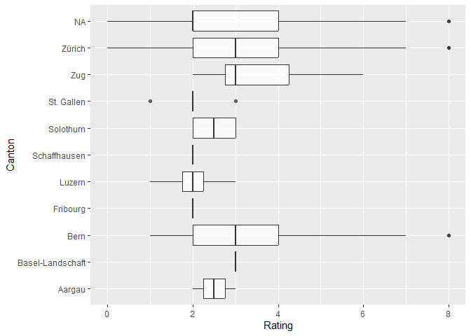

Data Analysis of IT jobs
================

Data Visualiization and Analysis from the data collected in the previous
steps from jobs.ch and itjobs.ch. Some of the job listings are rated
from a scale from 0,9 according to my interests and qualifications.

## Import Data

``` r
library(tidyverse)
library(jsonlite)
library(lubridate)
```

``` r
raw_df <- fromJSON("../data/jobs_processed.json")
raw_df <- bind_rows(raw_df)
raw_df <- tibble(raw_df)
glimpse(raw_df)
```

    ## Rows: 4,684
    ## Columns: 25
    ## $ company               <chr> NA, "BBT Software AG", "VAT Vakuumventile AG", "~
    ## $ contract_type         <chr> NA, NA, NA, "Unlimited employment", NA, NA, NA, ~
    ## $ descriptions          <list> [<data.frame[0 x 0]>], [<data.frame[1 x 1]>], [~
    ## $ downloaded            <lgl> TRUE, TRUE, TRUE, TRUE, TRUE, TRUE, TRUE, TRUE, ~
    ## $ job_title             <chr> "Bauingenieur*in (60-100%) Bereich Konstruktiver~
    ## $ language              <chr> NA, NA, NA, NA, NA, NA, NA, NA, "German (Interme~
    ## $ place_of_work         <chr> NA, "Root D4", NA, "Ringstrasse 39, 4106 Therwil~
    ## $ publication_date      <chr> NA, "06 February 2025", NA, "07 February 2025", ~
    ## $ rating                <dbl> NA, 2, NA, 6, NA, NA, NA, NA, 6, NA, NA, 4, NA, ~
    ## $ reviewed              <dbl> NA, 1, NA, 1, NA, NA, NA, NA, 1, NA, NA, 1, NA, ~
    ## $ salary                <chr> NA, NA, NA, NA, NA, NA, NA, NA, NA, NA, NA, NA, ~
    ## $ search_query          <chr> "data engineer", "all jobs", "software engineer"~
    ## $ url                   <chr> "https://www.jobs.ch/en/vacancies/detail/221d09c~
    ## $ website               <chr> NA, "ITJobs", "Jobs", NA, NA, NA, NA, NA, NA, "I~
    ## $ workload              <chr> NA, NA, NA, "100%", NA, NA, NA, NA, "80 – 100%",~
    ## $ career_stage_cleaned  <chr> NA, NA, NA, NA, NA, NA, NA, "senior", NA, NA, NA~
    ## $ canton                <chr> NA, NA, NA, NA, NA, NA, NA, NA, "Zürich", "Schwy~
    ## $ programming_languages <list> <>, <>, <>, <"MATLAB", "Python">, <>, <>, <>, <~
    ## $ frameworks            <list> <>, <>, <>, <>, <>, <>, <>, <>, <"Angular", "Sp~
    ## $ tools                 <list> <>, <>, <>, <>, <>, <>, <>, <>, <"Git", "Jenkin~
    ## $ operating_systems     <list> <>, <>, <>, <>, <>, <>, <>, <>, <>, <>, <>, <>,~
    ## $ years                 <list> <>, <>, <>, <>, <>, <>, <>, <>, 5, <>, <>, <>, ~
    ## $ education             <list> <>, <>, <>, "PhD", <>, <>, <>, <>, "Vocational"~
    ## $ job_title_cleaned     <chr> NA, "System Engineer", NA, "Research Engineer", ~
    ## $ job_category          <chr> NA, "Cloud/System Engineer", NA, "Software Engin~

## Clean Data

``` r
# convert datatypes
clean_df <- raw_df %>%
    mutate(publication_date = dmy(publication_date), 
        job_title_cleaned = factor(job_title_cleaned),
        career_stage_cleaned = factor(career_stage_cleaned),
        job_category = factor(job_category),
        canton = factor(canton),
        programming_languages = lapply(programming_languages, factor),
        frameworks = lapply(frameworks, factor),
        tools = lapply(tools, factor),
        operating_systems = lapply(operating_systems, factor),
        max_years = sapply(years, function(x) if (length(x) == 0) NA else max(as.numeric(x), na.rm = TRUE)), # get min number of years, and replace nan with 0
        programming_languages = ifelse(lengths(programming_languages) == 0, "No Programming Languages", programming_languages),
        frameworks = ifelse(lengths(frameworks) == 0, "No Frameworks", frameworks),
        tools = ifelse(lengths(tools) == 0, "No Tools", tools))
glimpse(clean_df)
```

    ## Rows: 4,684
    ## Columns: 26
    ## $ company               <chr> NA, "BBT Software AG", "VAT Vakuumventile AG", "~
    ## $ contract_type         <chr> NA, NA, NA, "Unlimited employment", NA, NA, NA, ~
    ## $ descriptions          <list> [<data.frame[0 x 0]>], [<data.frame[1 x 1]>], [~
    ## $ downloaded            <lgl> TRUE, TRUE, TRUE, TRUE, TRUE, TRUE, TRUE, TRUE, ~
    ## $ job_title             <chr> "Bauingenieur*in (60-100%) Bereich Konstruktiver~
    ## $ language              <chr> NA, NA, NA, NA, NA, NA, NA, NA, "German (Interme~
    ## $ place_of_work         <chr> NA, "Root D4", NA, "Ringstrasse 39, 4106 Therwil~
    ## $ publication_date      <date> NA, 2025-02-06, NA, 2025-02-07, NA, NA, NA, NA,~
    ## $ rating                <dbl> NA, 2, NA, 6, NA, NA, NA, NA, 6, NA, NA, 4, NA, ~
    ## $ reviewed              <dbl> NA, 1, NA, 1, NA, NA, NA, NA, 1, NA, NA, 1, NA, ~
    ## $ salary                <chr> NA, NA, NA, NA, NA, NA, NA, NA, NA, NA, NA, NA, ~
    ## $ search_query          <chr> "data engineer", "all jobs", "software engineer"~
    ## $ url                   <chr> "https://www.jobs.ch/en/vacancies/detail/221d09c~
    ## $ website               <chr> NA, "ITJobs", "Jobs", NA, NA, NA, NA, NA, NA, "I~
    ## $ workload              <chr> NA, NA, NA, "100%", NA, NA, NA, NA, "80 – 100%",~
    ## $ career_stage_cleaned  <fct> NA, NA, NA, NA, NA, NA, NA, senior, NA, NA, NA, ~
    ## $ canton                <fct> NA, NA, NA, NA, NA, NA, NA, NA, Zürich, Schwyz, ~
    ## $ programming_languages <list> "No Programming Languages", "No Programming Lan~
    ## $ frameworks            <list> "No Frameworks", "No Frameworks", "No Framework~
    ## $ tools                 <list> "No Tools", "No Tools", "No Tools", "No Tools",~
    ## $ operating_systems     <list> <>, <>, <>, <>, <>, <>, <>, <>, <>, <>, <>, <>,~
    ## $ years                 <list> <>, <>, <>, <>, <>, <>, <>, <>, 5, <>, <>, <>, ~
    ## $ education             <list> <>, <>, <>, "PhD", <>, <>, <>, <>, "Vocational"~
    ## $ job_title_cleaned     <fct> NA, System Engineer, NA, Research Engineer, NA, ~
    ## $ job_category          <fct> NA, Cloud/System Engineer, NA, Software Engineer~
    ## $ max_years             <dbl> NA, NA, NA, NA, NA, NA, NA, NA, 5, NA, NA, NA, N~

Check if some IT key words in listing title were missed during
preprocessing, and therefore have a NaN value in the `job_title_cleaned`
attribute.

``` r
clean_df %>%
  filter(is.na(job_title_cleaned)) %>%
  slice_head(n = 20) %>%
  pull(job_title) 
```

    ##  [1] "Bauingenieur*in (60-100%) Bereich Konstruktiver Wasserbau"                                  
    ##  [2] "Development Engineer Motion"                                                                
    ##  [3] "Responsable agence FS Vétroz"                                                               
    ##  [4] "2 PhD student positions in environmental soil chemistry (m/f/d)"                            
    ##  [5] "Wirtschaftsinformatikerin / Wirtschaftsinformatiker"                                        
    ##  [6] "Managing Director ETH Zurich | Space"                                                       
    ##  [7] "IT Operations Manager (w/m/d)"                                                              
    ##  [8] "Jurist:in Baurecht / Mandatsleitung 60-100%"                                                
    ##  [9] "Solution Architect:in 80–100 %"                                                             
    ## [10] "Quality Engineer"                                                                           
    ## [11] "217 .NET C# E ntwickler"                                                                    
    ## [12] "Data-Engineer/Data-Architect, 80–100 % (w/m/d)"                                             
    ## [13] "ProjektleiterIn in Schaffhausen"                                                            
    ## [14] "2 PhD Positions in Spine Biomechanics"                                                      
    ## [15] "Responsable du Service Bâtiments et Infrastructures"                                        
    ## [16] "Netzelektriker, Montage-Elektriker, Automatiker oder Polymechaniker (m/w/d) in Niedergösgen"
    ## [17] "Business Architekt/-in 80 - 100%"                                                           
    ## [18] "Responsable Qualité & Développement produits (h/f)"                                         
    ## [19] "IT Security Spezialist/-in 100%"                                                            
    ## [20] "Customer Support Engineer - Mexico, Brazil"

``` r
# drop NaN rows
df <- clean_df %>%
    filter(!is.na(job_title_cleaned) & !is.na(publication_date))%>%# drop rows with no cleaned job title, since they are probably no IT related jobs 
    filter(publication_date > as.Date("2025-01-01"))%>%
    filter(max_years <= 20) # outliers

    
glimpse(df)
```

    ## Rows: 372
    ## Columns: 26
    ## $ company               <chr> "ITech Consult AG", "Hug Engineering AG", "Persi~
    ## $ contract_type         <chr> "Freelance", "Unlimited employment", "Unlimited ~
    ## $ descriptions          <list> [<data.frame[3 x 3]>], [<data.frame[3 x 3]>], [~
    ## $ downloaded            <lgl> TRUE, TRUE, TRUE, TRUE, TRUE, TRUE, TRUE, TRUE, ~
    ## $ job_title             <chr> "Fullstack Applikationsentwickler(in) (Java, Ang~
    ## $ language              <chr> "German (Intermediate), English (Basic knowledge~
    ## $ place_of_work         <chr> "Zürich", "Im Geren 14, 8352 Elsau", "Sursee", "~
    ## $ publication_date      <date> 2025-02-05, 2025-01-08, 2025-02-03, 2025-01-16,~
    ## $ rating                <dbl> 6, NA, NA, NA, 7, NA, 2, NA, NA, NA, 4, NA, 8, N~
    ## $ reviewed              <dbl> 1, NA, NA, NA, 1, NA, 1, NA, NA, NA, 1, NA, 1, N~
    ## $ salary                <chr> NA, NA, NA, NA, NA, NA, NA, NA, NA, NA, NA, NA, ~
    ## $ search_query          <chr> "software engineer", "software engineer", "data ~
    ## $ url                   <chr> "https://www.jobs.ch/en/vacancies/detail/23d53c6~
    ## $ website               <chr> NA, NA, NA, NA, NA, NA, "Jobs", NA, NA, NA, "Job~
    ## $ workload              <chr> "80 – 100%", "100%", "100%", "80 – 100%", "80 – ~
    ## $ career_stage_cleaned  <fct> NA, NA, NA, NA, NA, NA, senior, NA, NA, NA, NA, ~
    ## $ canton                <fct> Zürich, NA, NA, NA, NA, NA, NA, NA, Schaffhausen~
    ## $ programming_languages <list> <Java, SQL>, <C, C++>, "No Programming Language~
    ## $ frameworks            <list> <Angular, Spring>, "No Frameworks", "No Framewo~
    ## $ tools                 <list> <Git, Jenkins>, "No Tools", "No Tools", <CI/CD,~
    ## $ operating_systems     <list> <>, <>, <>, <>, <>, <>, <>, <>, <>, <>, <>, <>,~
    ## $ years                 <list> 5, 2, 4, 3, 5, 3, <3, 5>, 2, 3, 2, <3, 5>, 5, 3~
    ## $ education             <list> "Vocational", <>, "Vocational", <>, <>, "PhD", ~
    ## $ job_title_cleaned     <fct> Applikationsentwickler, Automation Engineer, Sys~
    ## $ job_category          <fct> Software Engineer, Software Engineer, Cloud/Syst~
    ## $ max_years             <dbl> 5, 2, 4, 3, 5, 3, 5, 2, 3, 2, 5, 5, 3, 5, 3, 2, ~

## Visualize

``` r
df %>%
    count(publication_date) %>%
    ggplot(aes(publication_date, n)) +
    geom_line(aes(color = "All Listings"), linewidth = 1, alpha=0.5) +  # Line for all listings
    geom_line(data = df %>% filter(reviewed == TRUE) %>% count(publication_date), 
            aes(publication_date, n, color = "Reviewed Listings"), linewidth = 1, alpha=0.5) +  # Line for reviewed listings
    geom_point(aes(publication_date, n), alpha=0.5)+
    labs(title = "Number of scraped IT Job Listings per Day",
        x = "Date",
        y = "") +
    scale_color_manual(name = "Legend", values = c("All Listings" = "#1182ba", "Reviewed Listings" = "#71d171"))
```

<!-- -->

``` r
df %>%
  ggplot() +
  geom_bar(mapping=aes(x=rating), alpha = 0.7)+
  labs(x = "Rating",
       y = "Count") 
```

    ## Warning: Removed 228 rows containing non-finite values (`stat_count()`).

<!-- -->

``` r
df %>%
  ggplot() +
  geom_bar(mapping=aes(y=job_category), alpha = 0.7)+
  labs(y = "Job Category",
       x = "Count") 
```

<!-- -->

``` r
p <- ggplot(df, aes(max_years, career_stage_cleaned))  +
    geom_boxplot() +
    labs(y = "Career Stage",
        x = "Min years of experience") 
print(p)
```

<!-- -->

``` r
df %>%
    unnest(programming_languages) %>%         # Unnest the list column
    count(programming_languages) %>%           # Count occurrences of each language
    ggplot(aes(x = n, y = programming_languages)) +  
    geom_bar(stat = "identity", alpha = 0.7) +
    labs(x = "Count", y = "Programming Language")
```

<!-- -->

``` r
df %>%
    unnest(programming_languages) %>% 
    ggplot(aes(x = rating , y = programming_languages)) +
    geom_boxplot() +
    labs(x = "Rating", y = "Programming Languages")
```

    ## Warning: Removed 387 rows containing non-finite values (`stat_boxplot()`).

<!-- -->

``` r
df %>%
    count(search_query) 
```

    ## # A tibble: 4 x 2
    ##   search_query          n
    ##   <chr>             <int>
    ## 1 all jobs             45
    ## 2 data engineer        92
    ## 3 data scientist        9
    ## 4 software engineer   226

``` r
df %>%
    count(job_title_cleaned) %>%
    arrange(desc(n))
```

    ## # A tibble: 69 x 2
    ##    job_title_cleaned        n
    ##    <fct>                <int>
    ##  1 Software Engineer       71
    ##  2 System Engineer         56
    ##  3 Software Developer      17
    ##  4 Data Engineer           13
    ##  5 DevOps Engineer         12
    ##  6 Softwareentwickler      11
    ##  7 Application Engineer    10
    ##  8 Security Engineer       10
    ##  9 Systems Engineer        10
    ## 10 Automation Engineer      9
    ## # i 59 more rows

``` r
df %>%
    count(job_category) %>%
    ggplot(aes(x = n, y = job_category)) +
    geom_bar(stat = "identity")
```

<!-- -->

``` r
df %>%
    ggplot(aes(x = rating , y = job_category)) +
    geom_boxplot(alpha = 0.7) +
    labs(x = "Rating", y = "Job Category")
```

    ## Warning: Removed 228 rows containing non-finite values (`stat_boxplot()`).

<!-- -->

``` r
df %>%
    ggplot(aes(x = rating , y = canton)) +
    geom_boxplot(alpha = 0.7) +
    labs(x = "Rating", y = "Canton")
```

    ## Warning: Removed 228 rows containing non-finite values (`stat_boxplot()`).

<!-- -->

``` r
df %>%
    ggplot(aes(x = max_years, y = rating )) +
    geom_point(alpha = 0.7) +
    geom_smooth(method = "lm", se = FALSE, color = "blue") +
    labs(x = "Max Years of Experience", y = " Rating", title = "Correlation between Rating and Max Years of Experience")
```

    ## `geom_smooth()` using formula = 'y ~ x'

    ## Warning: Removed 228 rows containing non-finite values (`stat_smooth()`).

    ## Warning: Removed 228 rows containing missing values (`geom_point()`).

<!-- -->

## Fit Model

- Linear model is probably not the best for this usecase, classification
  with kNN / SVM might be more appropriate (TODO)

``` r
df_one_hot <- df %>%
    select(job_title, url, job_category, career_stage_cleaned, programming_languages, frameworks, max_years, rating ) %>% 
    # handle NA values as an "Non Value" factor
    mutate(
        job_category = factor(replace_na(as.character(job_category), "No Value")),
        career_stage_cleaned = factor(replace_na(as.character(career_stage_cleaned), "No Value")))
    
df_one_hot <- df_one_hot%>% 
    mutate(programming_languages = lapply(programming_languages, factor)) %>%
    unnest(programming_languages) %>%
    distinct() %>%
    mutate(temp = 1) %>%
    pivot_wider(names_from = programming_languages, values_from = temp, values_fill = list(temp = 0))


df_one_hot <- df_one_hot %>%   
    unnest(frameworks) %>%
    distinct() %>%
    mutate(temp = 1) %>%
    pivot_wider(names_from = frameworks, values_from = temp, values_fill = list(temp = 0))


glimpse(df_one_hot)
```

    ## Rows: 372
    ## Columns: 44
    ## $ job_title                  <chr> "Fullstack Applikationsentwickler(in) (Java~
    ## $ url                        <chr> "https://www.jobs.ch/en/vacancies/detail/23~
    ## $ job_category               <fct> Software Engineer, Software Engineer, Cloud~
    ## $ career_stage_cleaned       <fct> No Value, No Value, No Value, No Value, No ~
    ## $ max_years                  <dbl> 5, 2, 4, 3, 5, 3, 5, 2, 3, 2, 5, 5, 3, 5, 3~
    ## $ rating                     <dbl> 6, NA, NA, NA, 7, NA, 2, NA, NA, NA, 4, NA,~
    ## $ Java                       <dbl> 1, 0, 0, 0, 0, 0, 0, 0, 0, 0, 0, 0, 0, 1, 1~
    ## $ SQL                        <dbl> 1, 0, 0, 0, 1, 0, 0, 1, 0, 0, 0, 1, 0, 1, 1~
    ## $ C                          <dbl> 0, 1, 0, 0, 0, 1, 0, 0, 0, 0, 0, 0, 0, 0, 0~
    ## $ `C++`                      <dbl> 0, 1, 0, 0, 0, 1, 0, 0, 1, 0, 0, 0, 0, 0, 0~
    ## $ `No Programming Languages` <dbl> 0, 0, 1, 0, 0, 0, 0, 0, 0, 1, 0, 0, 0, 0, 0~
    ## $ `C#`                       <dbl> 0, 0, 0, 1, 0, 0, 0, 0, 0, 0, 0, 0, 1, 0, 0~
    ## $ Python                     <dbl> 0, 0, 0, 1, 0, 0, 1, 0, 0, 0, 1, 1, 0, 0, 0~
    ## $ MATLAB                     <dbl> 0, 0, 0, 0, 0, 1, 0, 0, 0, 0, 0, 0, 0, 0, 0~
    ## $ Shell                      <dbl> 0, 0, 0, 0, 0, 0, 1, 0, 0, 0, 0, 0, 0, 0, 0~
    ## $ Lua                        <dbl> 0, 0, 0, 0, 0, 0, 0, 0, 1, 0, 0, 0, 0, 0, 0~
    ## $ CSS                        <dbl> 0, 0, 0, 0, 0, 0, 0, 0, 0, 0, 0, 0, 1, 0, 0~
    ## $ HTML                       <dbl> 0, 0, 0, 0, 0, 0, 0, 0, 0, 0, 0, 0, 1, 0, 1~
    ## $ TypeScript                 <dbl> 0, 0, 0, 0, 0, 0, 0, 0, 0, 0, 0, 0, 1, 0, 1~
    ## $ JavaScript                 <dbl> 0, 0, 0, 0, 0, 0, 0, 0, 0, 0, 0, 0, 0, 0, 1~
    ## $ Bash                       <dbl> 0, 0, 0, 0, 0, 0, 0, 0, 0, 0, 0, 0, 0, 0, 0~
    ## $ Go                         <dbl> 0, 0, 0, 0, 0, 0, 0, 0, 0, 0, 0, 0, 0, 0, 0~
    ## $ PowerShell                 <dbl> 0, 0, 0, 0, 0, 0, 0, 0, 0, 0, 0, 0, 0, 0, 0~
    ## $ Kotlin                     <dbl> 0, 0, 0, 0, 0, 0, 0, 0, 0, 0, 0, 0, 0, 0, 0~
    ## $ PHP                        <dbl> 0, 0, 0, 0, 0, 0, 0, 0, 0, 0, 0, 0, 0, 0, 0~
    ## $ Dart                       <dbl> 0, 0, 0, 0, 0, 0, 0, 0, 0, 0, 0, 0, 0, 0, 0~
    ## $ Perl                       <dbl> 0, 0, 0, 0, 0, 0, 0, 0, 0, 0, 0, 0, 0, 0, 0~
    ## $ Rust                       <dbl> 0, 0, 0, 0, 0, 0, 0, 0, 0, 0, 0, 0, 0, 0, 0~
    ## $ Swift                      <dbl> 0, 0, 0, 0, 0, 0, 0, 0, 0, 0, 0, 0, 0, 0, 0~
    ## $ Angular                    <dbl> 1, 0, 0, 0, 0, 0, 0, 0, 0, 0, 0, 0, 0, 0, 1~
    ## $ Spring                     <dbl> 1, 0, 0, 0, 0, 0, 0, 0, 0, 0, 0, 0, 0, 1, 1~
    ## $ `No Frameworks`            <dbl> 0, 1, 1, 0, 1, 1, 1, 1, 1, 1, 1, 1, 0, 0, 0~
    ## $ React                      <dbl> 0, 0, 0, 1, 0, 0, 0, 0, 0, 0, 0, 0, 1, 0, 1~
    ## $ Next.js                    <dbl> 0, 0, 0, 0, 0, 0, 0, 0, 0, 0, 0, 0, 1, 0, 0~
    ## $ Vue                        <dbl> 0, 0, 0, 0, 0, 0, 0, 0, 0, 0, 0, 0, 0, 0, 1~
    ## $ .NET                       <dbl> 0, 0, 0, 0, 0, 0, 0, 0, 0, 0, 0, 0, 0, 0, 0~
    ## $ ASP.NET                    <dbl> 0, 0, 0, 0, 0, 0, 0, 0, 0, 0, 0, 0, 0, 0, 0~
    ## $ Node.js                    <dbl> 0, 0, 0, 0, 0, 0, 0, 0, 0, 0, 0, 0, 0, 0, 0~
    ## $ NestJS                     <dbl> 0, 0, 0, 0, 0, 0, 0, 0, 0, 0, 0, 0, 0, 0, 0~
    ## $ Svelte                     <dbl> 0, 0, 0, 0, 0, 0, 0, 0, 0, 0, 0, 0, 0, 0, 0~
    ## $ Django                     <dbl> 0, 0, 0, 0, 0, 0, 0, 0, 0, 0, 0, 0, 0, 0, 0~
    ## $ FastAPI                    <dbl> 0, 0, 0, 0, 0, 0, 0, 0, 0, 0, 0, 0, 0, 0, 0~
    ## $ Symfony                    <dbl> 0, 0, 0, 0, 0, 0, 0, 0, 0, 0, 0, 0, 0, 0, 0~
    ## $ Laravel                    <dbl> 0, 0, 0, 0, 0, 0, 0, 0, 0, 0, 0, 0, 0, 0, 0~

``` r
df_one_hot %>%
    mutate(has_rating = !is.na(rating)) %>%
    group_by(has_rating) %>%
    summarise(
        count = n())
```

    ## # A tibble: 2 x 2
    ##   has_rating count
    ##   <lgl>      <int>
    ## 1 FALSE        228
    ## 2 TRUE         144

``` r
df_model <- df_one_hot %>% filter(!is.na(rating))
df_to_predict <- df_one_hot %>% filter(is.na(rating))
set.seed(1)
sample <- sample(c(TRUE, FALSE), nrow(df_model), replace=TRUE, prob=c(0.8,0.2))
df_train  <- df_model[sample, ]
df_test   <- df_model[!sample, ]

# Fit a linear regression model
model <- lm(rating ~ . , data = df_train[,!colnames(df_train) %in% c("url", "job_title")])

# Summary of the model
summary(model)
```

    ## 
    ## Call:
    ## lm(formula = rating ~ ., data = df_train[, !colnames(df_train) %in% 
    ##     c("url", "job_title")])
    ## 
    ## Residuals:
    ##     Min      1Q  Median      3Q     Max 
    ## -2.8371 -0.6879  0.0000  0.5085  3.6351 
    ## 
    ## Coefficients: (6 not defined because of singularities)
    ##                                     Estimate Std. Error t value Pr(>|t|)    
    ## (Intercept)                          7.10315    1.84898   3.842 0.000245 ***
    ## job_categoryConsulting & Management -0.46678    0.58037  -0.804 0.423654    
    ## job_categoryData Engineer            3.54253    0.57211   6.192  2.5e-08 ***
    ## job_categoryDesign                  -1.35023    1.31530  -1.027 0.307763    
    ## job_categoryInfrastructure           0.21919    0.51064   0.429 0.668908    
    ## job_categorySecurity Engineer       -0.10835    0.58593  -0.185 0.853762    
    ## job_categorySoftware Engineer        0.88684    0.44171   2.008 0.048090 *  
    ## career_stage_cleanedNo Value        -3.68508    0.99904  -3.689 0.000412 ***
    ## career_stage_cleanedsenior          -3.82009    1.04259  -3.664 0.000448 ***
    ## max_years                           -0.13384    0.06431  -2.081 0.040670 *  
    ## Java                                -0.08138    0.55625  -0.146 0.884057    
    ## SQL                                  0.66022    0.45136   1.463 0.147503    
    ## C                                    0.02993    0.70564   0.042 0.966278    
    ## `C++`                               -0.84606    0.68550  -1.234 0.220780    
    ## `No Programming Languages`          -0.68401    0.62065  -1.102 0.273773    
    ## `C#`                                 0.51773    0.47565   1.088 0.279702    
    ## Python                               0.38089    0.49290   0.773 0.441981    
    ## MATLAB                               0.60830    0.82978   0.733 0.465678    
    ## Shell                               -0.63431    1.42736  -0.444 0.657972    
    ## Lua                                       NA         NA      NA       NA    
    ## CSS                                 -5.25867    1.92360  -2.734 0.007725 ** 
    ## HTML                                 4.62913    1.93321   2.395 0.019011 *  
    ## TypeScript                          -1.15325    1.18346  -0.974 0.332793    
    ## JavaScript                           0.76012    0.95812   0.793 0.429953    
    ## Bash                                -1.03700    1.38832  -0.747 0.457315    
    ## Go                                   0.89790    1.07135   0.838 0.404501    
    ## PowerShell                          -1.09657    0.72603  -1.510 0.134939    
    ## Kotlin                               2.93762    1.96037   1.498 0.137989    
    ## PHP                                  1.15852    1.34334   0.862 0.391070    
    ## Dart                                -0.05608    1.36665  -0.041 0.967371    
    ## Perl                                -2.36041    2.13668  -1.105 0.272639    
    ## Rust                                      NA         NA      NA       NA    
    ## Swift                                     NA         NA      NA       NA    
    ## Angular                             -0.19185    0.72368  -0.265 0.791622    
    ## Spring                               1.08116    0.96967   1.115 0.268237    
    ## `No Frameworks`                     -0.57965    1.18424  -0.489 0.625865    
    ## React                                1.43538    0.70998   2.022 0.046592 *  
    ## Next.js                              2.94936    1.16564   2.530 0.013386 *  
    ## Vue                                 -0.69178    1.58155  -0.437 0.663012    
    ## .NET                                 0.64196    1.80230   0.356 0.722648    
    ## ASP.NET                             -3.03780    2.04257  -1.487 0.140931    
    ## Node.js                                   NA         NA      NA       NA    
    ## NestJS                                    NA         NA      NA       NA    
    ## Svelte                               1.22018    2.48890   0.490 0.625317    
    ## Django                              -0.28429    1.85803  -0.153 0.878784    
    ## FastAPI                                   NA         NA      NA       NA    
    ## Symfony                              2.71818    2.80609   0.969 0.335665    
    ## Laravel                             -0.10416    2.21610  -0.047 0.962629    
    ## ---
    ## Signif. codes:  0 '***' 0.001 '**' 0.01 '*' 0.05 '.' 0.1 ' ' 1
    ## 
    ## Residual standard error: 1.243 on 79 degrees of freedom
    ## Multiple R-squared:  0.7288, Adjusted R-squared:  0.588 
    ## F-statistic: 5.177 on 41 and 79 DF,  p-value: 2.097e-10

``` r
# Predict on test set
predictions_test <- predict(model, newdata = df_test[,!colnames(df_test) %in% c("url", "job_title")])
```

    ## Warning in predict.lm(model, newdata = df_test[, !colnames(df_test) %in% :
    ## prediction from a rank-deficient fit may be misleading

``` r
df_test <- df_test %>% mutate(predicted_rating = predictions_test) 
df_test %>%
    ggplot(aes(x = rating, y = predicted_rating)) +
    geom_point(alpha=0.5, size = 3) +
    geom_abline(intercept = 0, slope = 1, color = "#2086b9", alpha = 0.5, linewidth = 2) +
    labs(x = "Actual Rating", y = "Predicted Rating")
```

<!-- -->

``` r
# assert that there are no levels in the prediction data that are not in the model
#model$xlevels[["url"]] <- union(model$xlevels[["url"]], levels(df_one_hot$url))
model$xlevels[["job_category"]] <- union(model$xlevels[["job_category"]], levels(df_one_hot$job_category))
#model$xlevels[["career_stage_cleaned"]] <- union(model$xlevels[["career_stage_cleaned"]], levels(df_one_hot$career_stage_cleaned))
#model$xlevels[["programming_languages"]] <- union(model$xlevels[["programming_languages"]], levels(df_one_hot$programming_languages))
#model$xlevels[["frameworks"]] <- union(model$xlevels[["frameworks"]], levels(df_one_hot$frameworks))

# prediction from a rank-deficient fit may be misleading -> we need more data
predictions <- predict(model, newdata = df_to_predict[,!colnames(df_to_predict) %in% c("url", "job_title")])
```

    ## Warning in predict.lm(model, newdata = df_to_predict[, !colnames(df_to_predict)
    ## %in% : prediction from a rank-deficient fit may be misleading

``` r
# Add predictions to df_to_predict
df_to_predict <- df_to_predict %>%
    mutate(predicted_rating = predictions)

# Glimpse the predictions
glimpse(df_to_predict)
```

    ## Rows: 228
    ## Columns: 45
    ## $ job_title                  <chr> "Automation Engineer Aftersales (f/m/d)", "~
    ## $ url                        <chr> "https://www.jobs.ch/en/vacancies/detail/b4~
    ## $ job_category               <fct> Software Engineer, Cloud/System Engineer, S~
    ## $ career_stage_cleaned       <fct> No Value, No Value, No Value, No Value, No ~
    ## $ max_years                  <dbl> 2, 4, 3, 3, 2, 3, 2, 5, 5, 3, 2, 2, 2, 2, 2~
    ## $ rating                     <dbl> NA, NA, NA, NA, NA, NA, NA, NA, NA, NA, NA,~
    ## $ Java                       <dbl> 0, 0, 0, 0, 0, 0, 0, 0, 1, 1, 0, 0, 0, 0, 0~
    ## $ SQL                        <dbl> 0, 0, 0, 0, 1, 0, 0, 1, 1, 1, 0, 0, 0, 0, 0~
    ## $ C                          <dbl> 1, 0, 0, 1, 0, 0, 0, 0, 0, 0, 0, 0, 0, 0, 0~
    ## $ `C++`                      <dbl> 1, 0, 0, 1, 0, 1, 0, 0, 0, 0, 0, 0, 0, 0, 0~
    ## $ `No Programming Languages` <dbl> 0, 1, 0, 0, 0, 0, 1, 0, 0, 0, 1, 1, 0, 0, 0~
    ## $ `C#`                       <dbl> 0, 0, 1, 0, 0, 0, 0, 0, 0, 0, 0, 0, 1, 0, 1~
    ## $ Python                     <dbl> 0, 0, 1, 0, 0, 0, 0, 1, 0, 0, 0, 0, 0, 0, 0~
    ## $ MATLAB                     <dbl> 0, 0, 0, 1, 0, 0, 0, 0, 0, 0, 0, 0, 0, 0, 0~
    ## $ Shell                      <dbl> 0, 0, 0, 0, 0, 0, 0, 0, 0, 0, 0, 0, 0, 0, 0~
    ## $ Lua                        <dbl> 0, 0, 0, 0, 0, 1, 0, 0, 0, 0, 0, 0, 0, 0, 0~
    ## $ CSS                        <dbl> 0, 0, 0, 0, 0, 0, 0, 0, 0, 0, 0, 0, 1, 1, 1~
    ## $ HTML                       <dbl> 0, 0, 0, 0, 0, 0, 0, 0, 0, 1, 0, 0, 0, 1, 1~
    ## $ TypeScript                 <dbl> 0, 0, 0, 0, 0, 0, 0, 0, 0, 1, 0, 0, 0, 0, 1~
    ## $ JavaScript                 <dbl> 0, 0, 0, 0, 0, 0, 0, 0, 0, 1, 0, 0, 1, 0, 1~
    ## $ Bash                       <dbl> 0, 0, 0, 0, 0, 0, 0, 0, 0, 0, 0, 0, 0, 1, 0~
    ## $ Go                         <dbl> 0, 0, 0, 0, 0, 0, 0, 0, 0, 0, 0, 0, 0, 0, 0~
    ## $ PowerShell                 <dbl> 0, 0, 0, 0, 0, 0, 0, 0, 0, 0, 0, 0, 0, 0, 0~
    ## $ Kotlin                     <dbl> 0, 0, 0, 0, 0, 0, 0, 0, 0, 0, 0, 0, 0, 0, 0~
    ## $ PHP                        <dbl> 0, 0, 0, 0, 0, 0, 0, 0, 0, 0, 0, 0, 0, 0, 0~
    ## $ Dart                       <dbl> 0, 0, 0, 0, 0, 0, 0, 0, 0, 0, 0, 0, 0, 0, 0~
    ## $ Perl                       <dbl> 0, 0, 0, 0, 0, 0, 0, 0, 0, 0, 0, 0, 0, 0, 0~
    ## $ Rust                       <dbl> 0, 0, 0, 0, 0, 0, 0, 0, 0, 0, 0, 0, 0, 0, 0~
    ## $ Swift                      <dbl> 0, 0, 0, 0, 0, 0, 0, 0, 0, 0, 0, 0, 0, 0, 0~
    ## $ Angular                    <dbl> 0, 0, 0, 0, 0, 0, 0, 0, 0, 1, 0, 0, 1, 0, 0~
    ## $ Spring                     <dbl> 0, 0, 0, 0, 0, 0, 0, 0, 1, 1, 0, 0, 0, 0, 0~
    ## $ `No Frameworks`            <dbl> 1, 1, 0, 1, 1, 1, 1, 1, 0, 0, 1, 1, 0, 0, 0~
    ## $ React                      <dbl> 0, 0, 1, 0, 0, 0, 0, 0, 0, 1, 0, 0, 0, 0, 1~
    ## $ Next.js                    <dbl> 0, 0, 0, 0, 0, 0, 0, 0, 0, 0, 0, 0, 0, 0, 0~
    ## $ Vue                        <dbl> 0, 0, 0, 0, 0, 0, 0, 0, 0, 1, 0, 0, 0, 1, 0~
    ## $ .NET                       <dbl> 0, 0, 0, 0, 0, 0, 0, 0, 0, 0, 0, 0, 1, 0, 0~
    ## $ ASP.NET                    <dbl> 0, 0, 0, 0, 0, 0, 0, 0, 0, 0, 0, 0, 1, 0, 0~
    ## $ Node.js                    <dbl> 0, 0, 0, 0, 0, 0, 0, 0, 0, 0, 0, 0, 0, 1, 0~
    ## $ NestJS                     <dbl> 0, 0, 0, 0, 0, 0, 0, 0, 0, 0, 0, 0, 0, 0, 0~
    ## $ Svelte                     <dbl> 0, 0, 0, 0, 0, 0, 0, 0, 0, 0, 0, 0, 0, 0, 0~
    ## $ Django                     <dbl> 0, 0, 0, 0, 0, 0, 0, 0, 0, 0, 0, 0, 0, 0, 0~
    ## $ FastAPI                    <dbl> 0, 0, 0, 0, 0, 0, 0, 0, 0, 0, 0, 0, 0, 0, 0~
    ## $ Symfony                    <dbl> 0, 0, 0, 0, 0, 0, 0, 0, 0, 0, 0, 0, 0, 0, 0~
    ## $ Laravel                    <dbl> 0, 0, 0, 0, 0, 0, 0, 0, 0, 0, 0, 0, 0, 0, 0~
    ## $ predicted_rating           <dbl> 2.641457, 1.619074, 6.237402, 3.115918, 3.4~

## Show most promising non-rated predictions

``` r
# Add a column with clickable URLs
df_to_predict <- df_to_predict %>%
    mutate(clickable_url = paste0("[", url, "](", url, ")"))

# Show most promising non-rated predictions with clickable URLs
df_to_predict %>%
    arrange(desc(predicted_rating)) %>%
    select(job_title, clickable_url, predicted_rating) %>%
    slice_head(n = 20) %>%
    knitr::kable()
```

| job_title                                                                               | clickable_url                                                                   | predicted_rating |
|:----------------------------------------------------------------------------------------|:--------------------------------------------------------------------------------|-----------------:|
| Software Engineer (w/m/d) 80 – 100%                                                     | <https://www.jobs.ch/en/vacancies/detail/830e5c06-c6bb-4c1b-8b92-0850edcd5a00/> |        10.351159 |
| Senior Fullstack Entwickler:in PHP (60-100%)                                            | <https://www.jobs.ch/en/vacancies/detail/007316a1-38e9-445a-a27c-ddfa5a556409/> |        10.242643 |
| Software Engineer mit Fokus Frontend (w/m/d)                                            | <https://www.jobs.ch/en/vacancies/detail/0027f781-dbb0-466b-ad87-4e25b18e898d/> |         9.020261 |
| Senior Java Software Engineer im Bereich Party Master Data Management (m/w/d) 80 - 100% | <https://www.jobs.ch/en/vacancies/detail/1480c988-83d7-4117-b1e4-38de78cc0523/> |         7.414908 |
| Data Engineer / Data Analyst - Azure IoT (80-100%)                                      | <https://www.jobs.ch/en/vacancies/detail/a19e5f73-f3f5-4549-9040-794c40e14c5b/> |         7.154386 |
| Fullstack Java Software Engineer (M/W)                                                  | <https://www.jobs.ch/en/vacancies/detail/f947b9ca-b309-4830-8fff-2c1b9b4bf693/> |         7.129372 |
| Senior Fullstack Entwickler:in .NET (60-100%)                                           | <https://www.jobs.ch/en/vacancies/detail/2c91d743-26a9-4c27-ab80-bada14698093/> |         7.099239 |
| Data Engineer                                                                           | <https://www.jobs.ch/en/vacancies/detail/d94dcbd4-d512-44b3-b7c9-388b4d0cee46/> |         6.773499 |
| DATA ENGINEER exp. DATABRICKS                                                           | <https://www.jobs.ch/en/vacancies/detail/6f07c2ea-fc17-4554-8512-405e81cf0140/> |         6.752879 |
| Senior AI Engineer & Consultant (a)                                                     | <https://www.jobs.ch/en/vacancies/detail/57ae08b5-2a69-4af2-905e-5b7a103da5af/> |         6.665573 |
| Senior AI Engineer & Consultant (a)                                                     | <https://www.itjobs.ch/jobs/senior-ai-engineer-consultant-a/120535/>            |         6.665573 |
| Senior Data Engineer (m/w/d)                                                            | <https://www.jobs.ch/en/vacancies/detail/83382fb2-8c64-4596-a2ea-4e2196832dd8/> |         6.638488 |
| Senior Database Engineer 80-100%                                                        | <https://www.jobs.ch/en/vacancies/detail/b25004b1-d527-4761-b0d2-aa1bbb153880/> |         6.638488 |
| Senior Data Engineer                                                                    | <https://www.jobs.ch/en/vacancies/detail/da56fc27-2b25-4eaa-aec0-b04705b9c7db/> |         6.617868 |
| Teamlead Data (w/m/d)                                                                   | <https://www.jobs.ch/en/vacancies/detail/7ffad37d-4f1c-4abd-8ab7-1929c82fdd87/> |         6.505828 |
| Senior Data Engineer                                                                    | <https://www.jobs.ch/en/vacancies/detail/0497859b-aeb2-4f8e-8b0d-2d56b3d00452/> |         6.487042 |
| ICT Professional Applikations-Entwickler:in (100%)                                      | <https://www.jobs.ch/en/vacancies/detail/65fc362a-9622-493c-a3df-6022896bb52b/> |         6.460414 |
| Business & Data Analyst im Versicherungsumfeld (m/w/d) 80 - 100 %                       | <https://www.jobs.ch/en/vacancies/detail/abcef6b5-9dd4-4b46-8c4f-7da34abae029/> |         6.371993 |
| Data Architect                                                                          | <https://www.jobs.ch/en/vacancies/detail/831a204f-fcd9-4193-a2bd-b3e7d3761c29/> |         6.351373 |
| Fullstack Engineer 80 - 100 % (f/m/d)                                                   | <https://www.jobs.ch/en/vacancies/detail/73a64291-f310-4029-ab10-997ddae30f90/> |         6.237402 |

## Show highest rated jobs

``` r
# Add a column with clickable URLs
df_model <- df_model %>%
    mutate(clickable_url = paste0("[", url, "](", url, ")"))

# Show most promising non-rated predictions with clickable URLs
df_model %>%
    arrange(desc(rating)) %>%
    select(job_title, clickable_url, rating) %>%
    slice_head(n = 20) %>%
    knitr::kable()
```

| job_title                                                                        | clickable_url                                                                     | rating |
|:---------------------------------------------------------------------------------|:----------------------------------------------------------------------------------|-------:|
| Software Engineer Full-Stack – React Web / C# – 80% – Zürich – Digital Democracy | <https://www.jobs.ch/en/vacancies/detail/c1951c65-086f-4d60-a301-b9afbdb28f40/>   |      8 |
| Fullstack Java/Angular Developer                                                 | <https://www.jobs.ch/en/vacancies/detail/570c3b99-db96-4d53-9d3f-c649666df7fd/>   |      8 |
| (Junior) Software Engineer C#/.NET (80 – 100%) (a)                               | <https://www.jobs.ch/en/vacancies/detail/897ff339-03e9-49c1-8e23-c6861db9f556/>   |      8 |
| Data Engineer                                                                    | <https://www.jobs.ch/en/vacancies/detail/02b55667-90a0-4e9a-801c-01d8bdce3caa/>   |      8 |
| Softwareentwickler/in - Python (m/w/d)                                           | <https://www.jobs.ch/en/vacancies/detail/4f886ee9-7fad-4624-8b09-852ae633130d/>   |      8 |
| Java / Full Stack Developer (part-time possible, all genders)                    | <https://www.jobs.ch/en/vacancies/detail/285a0cf4-2c45-4c66-be24-d71209e34e06/>   |      8 |
| Data Engineer for Clinical Trials 80 - 100 % (f/m/d)                             | <https://www.jobs.ch/en/vacancies/detail/5543d29f-fa16-4f46-8239-8d9199c4fbbe/>   |      8 |
| Data Analyst (alle)                                                              | <https://www.jobs.ch/en/vacancies/detail/f7345123-d71c-4a47-b6dc-dfe5f17acbc7/>   |      7 |
| Erfahrener Java Software Engineer 80 - 100% (m/w/d)                              | <https://www.jobs.ch/en/vacancies/detail/704f6930-af1f-4253-92d4-617c4f615df8/>   |      7 |
| Software Engineer als Full Stack Web Developer                                   | <https://www.jobs.ch/en/vacancies/detail/127a7968-522e-4419-8773-ebea399215b6/>   |      7 |
| Frontend Engineer (part-time possible, all genders)                              | <https://www.jobs.ch/en/vacancies/detail/25436ec9-2273-4cb3-b645-d869d06f146f/>   |      7 |
| Fullstack Applikationsentwickler(in) (Java, Angular)                             | <https://www.jobs.ch/en/vacancies/detail/23d53c66-128e-494c-bea8-4f787932be04/>   |      6 |
| Software Developer Full-Stack JavaEE & Angular (w/m/d)                           | <https://www.jobs.ch/en/vacancies/detail/092b1556-29fd-4366-93e1-4b63e75651b6/>   |      6 |
| Junior Requirements Engineer (60 – 100%) (a)                                     | <https://www.jobs.ch/en/vacancies/detail/5acb2c12-a282-4441-b949-8e6ea4eae666/>   |      6 |
| Frontend Developer bei Schweizer Startup                                         | <https://www.jobs.ch/en/vacancies/detail/e0b64094-e9cc-4191-ae8d-06163dd98440/>   |      6 |
| Software Systems Engineer - Business Support Services Technology                 | <https://www.jobs.ch/en/vacancies/detail/6f43cbd9-8576-49f5-af4d-9f4498f28d0e/>   |      6 |
| Fullstack Entwickler (Java & Angular)                                            | <https://www.jobs.ch/en/vacancies/detail/bebee9bf-861f-489a-83c4-f5a32b9380be/>   |      6 |
| AI Risk Manager / Senior Data Scientist (all genders)                            | <https://www.jobs.ch/en/vacancies/detail/ed39bd0a-307e-4601-beb4-43cf5309f89d/>   |      6 |
| Senior Fullstack Engineer (C#, Angular, Python) (a)                              | <https://www.itjobs.ch/jobs/senior-fullstack-engineer-c-angular-python-a/121249/> |      6 |
| Data Engineer (alle)                                                             | <https://www.jobs.ch/en/vacancies/detail/920e44b5-a2a5-4a26-8589-bd5fb929c2d2/>   |      5 |
